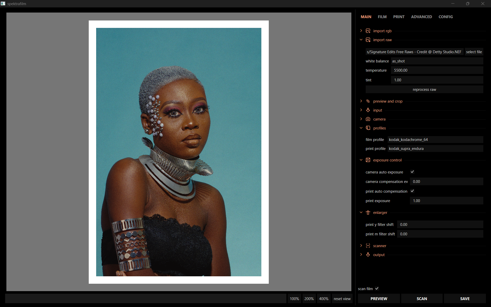
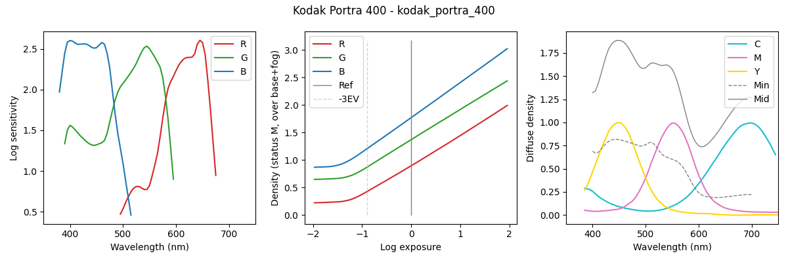
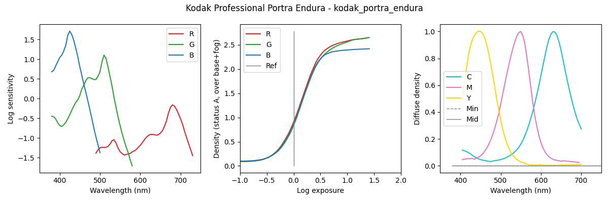
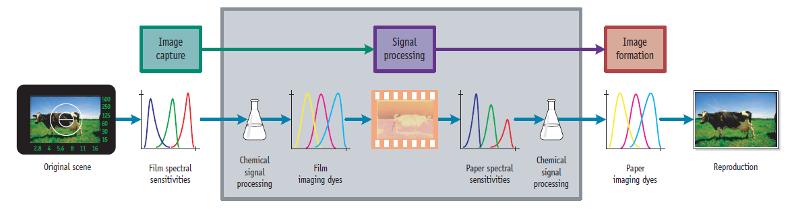
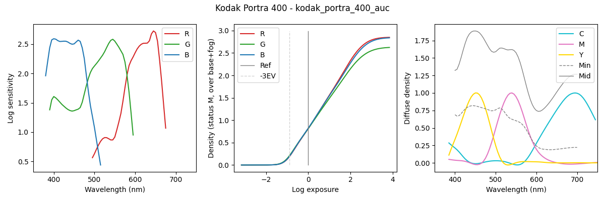
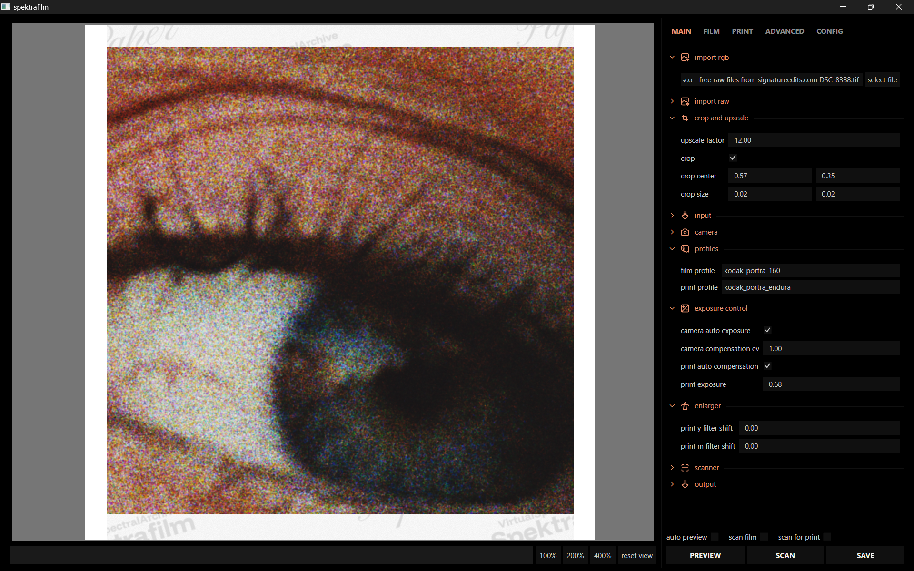

# 模拟摄影的光谱胶片模拟

> [!IMPORTANT]
> 当前阶段，本项目仍处于高度实验性和开发中状态。功能可能快速变化，目前主要用于探索和验证模拟模型。

本项目探索如何利用厂商数据表中的光谱数据，构建一个端到端的、基于物理的光谱计算模型，目标是将这些数据转化为逼真的胶片、印相和扫描渲染效果，并支持交互式探索。

项目的高层介绍和讨论详见 [discuss.pixls.us](https://discuss.pixls.us/t/spectral-film-simulations-from-scratch/48209)。

在实践中，spektrafilm 既是一个研究平台，也是一个半可用的实验工具（未来在稳定并支持 GPU 加速后可能会完全可用 :）。你可以从一张相机图像出发，将其通过虚拟的负片、印相和扫描流程，观察胶片乳剂数据、耦合剂、放大机设置、颗粒、光晕以及其他摄影效果如何影响最终结果。项目的目标不仅仅是模仿泛化的"胶片感"，而是构建一个与真实摄影材料结构和行为保持关联的模型。



桌面 GUI 让你无需编写代码即可完成上述工作流程——导入 RAW 文件或预处理好的线性图像，探索不同的胶片和相纸配置文件，交互式调整模拟参数，并在快速（勉强算快）预览和更精细的最终扫描之间快速切换。

## 简介

该模拟从已发布的胶片乳剂数据出发，模拟负片或正片胶片乳剂。下图展示了柯达 Portra 400（数据表 e4050，2016）的特性曲线（注意 CMY 扩散密度是通用的，因为通常不会公开发布）。



下图展示了柯达 Portra Endura 相纸（数据表 e4021，2009）的数据。



左图显示了各色彩层的光谱对数灵敏度。中图显示了在参考光源下对中灰梯级曝光时各层的对数曝光-密度特性曲线。右图显示了化学冲洗过程中在介质上形成的染料吸收光谱。"Min"和"Mid"分别代表未曝光的已处理介质和中灰"中间"曝光的吸收值。

从相机 RAW 文件的线性 RGB 数据开始，模拟过程重建光谱数据，将穿过虚拟负片的光线投射到相纸上，并使用带有二向色滤光片的简化彩色放大机来平衡印相。最终，使用从相纸反射的光线对虚拟印相进行扫描。

流程示意图如下（改编自 [^1]）：

场景光线（来自相机 RAW 文件）曝光到具有特定光谱灵敏度的虚拟负片上，然后通过化学过程利用密度曲线和更复杂的耦合剂交互模型生成染料密度。虚拟负片通过特定光源投射到相纸上，再次冲洗（本模型中相纸使用简单密度曲线，无耦合剂）。相纸本身经过设计以减少通道串扰，因为它不需要采样场景，只需要记录负片上的染料。

该流程允许以物理合理的方式添加多种特性，例如：

- 光晕（halation）
- 负片上生成的胶片颗粒（使用随机模型）
- 相纸的预闪（pre-flashing）以保留高光细节

根据我构建配置文件的经验，仅靠数据表曲线远不足以再现令人信服的胶片效果。关键在于理解胶片乳剂中含有耦合剂——在冲洗过程中与 CMY 染料同时产生的化学物质——它们对于实现预期的饱和度至关重要。主要的耦合剂类型包括：

- **遮罩耦合剂（masking couplers）**：赋予未曝光已冲洗胶片典型的橙色。这些耦合剂在密度形成处被局部消耗，用于减少层间吸收串扰的影响，从而提高饱和度。遮罩耦合剂的存在通过在孤立染料吸收光谱中的负吸收贡献来模拟。例如，Portra 400 更新后的数据（包含遮罩耦合剂和解混密度特性曲线）：


- **直接抑制耦合剂（direct inhibitor couplers）**：在密度形成时局部释放，抑制相邻层或同一层的密度形成，从而提高饱和度和对比度。如果让耦合剂在空间中扩散，还能增强局部对比度和感知锐度。

关于彩色耦合剂的更详细描述，请参见 Hunt 著作的第 15 章 [^2]。

## 包结构

代码库按 [src/spektrafilm](src/spektrafilm)、[src/spektrafilm_gui](src/spektrafilm_gui) 和 [src/spektrafilm_profile_creator](src/spektrafilm_profile_creator) 三个包组织：

1. [src/spektrafilm](src/spektrafilm)：运行时模拟管线和已处理配置文件的消费。
2. [src/spektrafilm_gui](src/spektrafilm_gui)：基于运行时包构建的桌面 GUI。
3. [src/spektrafilm_profile_creator](src/spektrafilm_profile_creator)：原始曲线处理和配置文件生成/拟合工作流。

标准导入接口：

1. 运行时 API：[src/spektrafilm/runtime/api.py](src/spektrafilm/runtime/api.py)。
2. GUI 入口：[src/spektrafilm_gui/app.py](src/spektrafilm_gui/app.py)。

最简运行时 API：

```python
from spektrafilm import create_params, simulate

params = create_params(
	film_profile="kodak_portra_400",
	print_profile="kodak_portra_endura",
)
result = simulate(image, params)
```

依赖方向：

1. `spektrafilm_gui` 依赖 `spektrafilm`。
2. `spektrafilm_profile_creator` 依赖 `spektrafilm`。
3. `spektrafilm` 不依赖上述两个高层包。

## 安装

> [!NOTE]
> 由于 agx-emulsion 与最新 Python 版本不兼容，需使用较旧版本如 3.13。

### 使用 `uv`

你可以使用 [uv](https://docs.astral.sh/uv/) 直接从 Git 仓库运行最新版本的 spektrafilm：

```bash
uvx --python 3.13 --from git+https://github.com/andreavolpato/spektrafilm.git spektrafilm
```

或从本地工作副本运行：
```bash
uvx --python 3.13 path/to/local/working_copy
```

也可以永久安装 spektrafilm，安装后将提供 `spektrafilm` 命令：

```bash
uv tool install --python 3.13 git+https://github.com/andreavolpato/spektrafilm.git
```

#### 安装 uv

在 Windows 上，使用以下命令安装 `uv`（仅需执行一次）：
```bash
# ! 仅首次安装 uv 时需要执行此命令！
powershell -ExecutionPolicy ByPass -c "irm https://astral.sh/uv/install.ps1 | iex"
```
macOS 和 Linux 的安装说明请参见 [此处](https://docs.astral.sh/uv/getting-started/installation/#standalone-installer)。

### 使用 `pip`

你也可以正常使用 `pip`：
```bash
# 安装：
git clone https://github.com/andreavolpato/spektrafilm.git
cd spektrafilm
pip install -e .

# 运行
spektrafilm
```
但建议创建一个干净的虚拟环境来安装依赖，例如使用 `conda`。

#### 使用 `conda`

在终端中：

```bash
conda create -n spektrafilm python=3.13
conda activate spektrafilm
```

进入仓库文件夹并安装 `spektrafilm` 包：

```bash
pip install -e .
```

激活环境后启动 GUI：

```bash
spektrafilm
```

移除环境：
```bash
conda env remove -n spektrafilm
```

## 测试

安装开发依赖后运行测试套件：

```bash
pip install -e ".[dev]"
python -m pytest tests -v
```

回归快照存储为 `tests/baselines/` 中的 `.npz` 文件，由 `tests/test_regression_baselines.py` 进行检查。
当模拟变更是有意为之的，需手动重新生成快照：

```bash
python scripts/regenerate_test_baselines.py
```

快照文件在 pytest 运行期间不会自动更新。

## GUI

启动 GUI 后，会出现一个 `napari` 窗口。请注意 `napari` 不支持色彩管理。我的工作方式是将屏幕和操作系统色彩配置文件设为 sRGB，并将模拟的输出色彩空间也设为 sRGB。在 Windows 上，GUI 会尝试获取显示配置文件并将最终图像转换为适配显示；如果成功，状态栏会显示相应提示。

你可以直接从 `import raw` 部分导入相机 RAW 文件。选择白平衡模式（`as shot`、`daylight`、`tungsten` 或 `custom`），使用 `custom` 时设置色温和色调，然后点击 `select file`。RAW 导入器使用 `rawpy`，并将图像转换为当前的 `input color space` 和 `apply CCTF decoding` 设置。你可以使用 `reprocess raw` 重新加载同一文件并使用新设置重新处理。

RAW 导入的像素仍是 rawpy/LibRaw 输出范围归一化后的线性 RGB：`gamma=(1, 1)`、`no_auto_bright=True`、`output_bps=16`，随后除以 `65535`。这不是物理 diffuse white calibration。导入器会同时记录 HDR 诊断 sidecar，包括 rawpy RGB 百分位、接近裁切的比例、可用 raw sensor black/white 统计、自动 diffuse-white 估计和 headroom 估计。这个估计用于后续 scene-energy / HDR rendition 工作；它会被标记为自动估计，不能替代用户选白卡或灰卡的真实校准。

> [!TIP]
> 将鼠标悬停在控件上可查看有用的工具提示。

你仍然可以通过 `file loader` 加载外部预处理的线性图像。这适用于需要完全手动 RAW 处理工作流或偏好在其他工具中预处理的情况。为获得最佳效果，保持图像为场景参考和线性格式，最好是 16 位或 32 位浮点 TIFF/EXR，使用宽色域色彩空间如线性 Rec2020 或线性 ProPhoto RGB。

> [!IMPORTANT]
> `file loader` 使用 OpenImageIO 导入 16 位和 32 位图像文件作为新图层。PNG、TIFF 和 EXR 已知可用，其他格式也可能支持。

在 `Output` 面板中，`Color workflow` 默认为 `manual`，保留独立的输入、输出和保存色彩空间控制。选择 `aces_reference` 后，运行前会把当前输入解释为其标记的源色彩空间并转换到场景线性 `ACEScg`，模拟输出也保持为未裁切的线性 `ACEScg`。保存时默认把该工作空间转换为线性 `ACES2065-1`，用于 EXR 交换/归档；PNG/JPEG 仍要求带 CCTF 的显示编码数据，线性 ACES 应保存为 EXR。

请注意这是一个高度实验性的项目，GUI 中的许多控件几乎没有文档说明。请通过悬停查看工具提示，或直接探索代码。
调整 `exposure_compensation_ev` 可改变负片曝光。按下 `scan_film` 和 `PREVIEW/SCAN` 可查看虚拟扫描效果。
`Camera auto exposure` 默认使用 `scene_linear` 测光：以线性 `0.184` 作为中灰目标，用稳健的 log-average 统计处理中间调，并允许 ACES/scene-linear 输入保留大于 `1.0` 的 HDR 高光而不让少量高光主导曝光。这个功能只决定虚拟相机曝光，不等同于物理 diffuse-white calibration；需要精确 HDR 场景能量时仍应使用灰卡/白卡或后续校准信号。

微调光晕时，调整 `scattering size`、`scattering strength`、`halation size` 和 `halation strength`。每项各有三个控件，定义对三个颜色通道（RGB）的影响。`scattering size` 和 `halation size` 表示高斯模糊的 sigma 值，`scattering strength` 和 `halation strength` 指散射或光晕光的百分比。
`y filter shift` 和 `m filter shift` 是彩色放大机虚拟黄色和品红滤光片的控件。它们是从中性位置偏移的步数——即使在使用正确参考光源拍摄的 18% 灰卡在最终印相中完全中性的起始设置。

有多个控件可在流程的不同阶段应用镜头模糊，例如相机镜头、放大机镜头或扫描仪。还有一个控件用于模糊密度以模拟冲洗过程中的扩散（`grain > blur`）。扫描仪还通过简单的 USM 锐化滤镜提供锐度控制。

例如，将胶片的局部裁剪放大 12 倍可以揭示染料云团。



这是我最着迷的方面之一，尤其是在考虑大尺寸、高分辨率的模拟图像打印时，能够保留原始图像中不存在的低层次颗粒细节。

## 使用 darktable 手动准备输入图像

GUI 中的直接 RAW 导入是最简单的工作流，但当你需要对输入渲染进行更精细控制时，手动处理仍然很有用。

模拟期望输入为线性场景参考文件，可带或不带传递函数。我通常使用 [darktable](https://www.darktable.org/) 打开数码相机的 RAW 文件，停用 `filmic` 或 `sigmoid` 的非线性映射，并调整曝光以保留所有信息同时避免裁切。然后将文件导出为线性 ProPhoto RGB 的 32 位浮点 TIFF。

## GUI 使用示例

[观看 GUI 演示视频](https://github.com/user-attachments/assets/534746b5-87ec-4bd0-96c9-5214ef7e381b)

## 需要注意的事项

- 对于全分辨率图像，模拟速度相当慢。在我的笔记本电脑上处理 6 MP 图像大约需要 10 秒。我通常使用 `PREVIEW` 调整大部分参数。需要最终图像时使用 `SCAN`，它会绕过图像缩放。
- 根据我构建配置文件的经验，富士胶片的数据一致性不如柯达。

## Support

spektrafilm is developed in my free time, often during late nights after my research work at KTH. If you'd like to support continued development and help fuel the next all-nighter coding session, consider [buying me a coffee](https://buymeacoffee.com/andreavolpato). Your contributions help me dedicate more time to the project and giving back to the [pixls.us](https://discuss.pixls.us/) community.

## 参考文献

[^1]: Giorgianni, Madden, Digital Color Management, 2nd edition, 2008 Wiley
[^2]: Hung, The Reproduction of Color, 6th edition, 2004 Wiley
[^3]: Mallett, Yuksel, Spectral Primary Decomposition for Rendering with sRGB Reflectance, Eurographics Symposium on Rendering - DL-only and Industry Track, 2019, doi:10.2312/SR.20191216

示例图像来自 [signatureedits.com](https://www.signatureedits.com/)/free-raw-photos。

---

## 当前推进方向

我们团队目前正在推进以下四个方向，旨在提升 spektrafilm 的性能、输出能力和色彩管理质量：

### 1. GPU 硬件加速

当前核心运行链路基于 Python + NumPy/SciPy/colour-science + Numba。已有的 CPU 优化包括 `fast_interp`、`fast_gaussian_filter` 等 Numba 热点内核，以及 `SpectralLUTService` 的 3D LUT 加速。下一步 GPU 化的策略是"保留 CPU 为数值基准，逐步替换高 ROI 内核"，而非全量重写。

- **Apple Silicon 继续使用 MLX/Metal**，并新增 **CuPy** 后端用于 CUDA/ROCm 设备。MLX 负责已有的 Metal custom kernel；CuPy 负责通用数组、矩阵、LUT、插值、Gaussian/FFT 卷积等可移植 GPU 热点。
- 第一批 GPU 加速目标：LUT 采样、RGB 到 raw 转换、密度/光谱矩阵计算、扫描输出、Gaussian/FFT 卷积。
- CPU 路径保持默认可用，GPU 路径以 `compute_backend = "auto" | "cpu" | "mlx" | "cupy" | "cuda"` 形式接入。`auto` 会优先尝试 MLX，再尝试 CuPy，最后回退 CPU。
- Apple GPU 可安装 `spektrafilm[gpu-apple]`；NVIDIA CUDA 12 可安装 `spektrafilm[gpu-cuda12]`。其他 CUDA/ROCm 组合请按 CuPy 官方说明安装与驱动匹配的 CuPy 包。

> ✅ **已完成**：MLX Metal kernel 实现 2D LUT 三次插值（Mitchell-Netravali）、密度层 GPU 插值、CCTF 解码、RGB→XYZ 变换；新增 CuPy 后端选择和 CUDA/ROCm 数组路径；密度曲线、LUT、Gaussian/FFT 卷积模块接入通用后端分发机制。

### 2. HDR EXR 与 HDR 照片输出

默认 SDR 预览、SDR 导出、胶片/印相/扫描运行时和 `look_rgb` 生成路径保持不变。HDR 输出是显式导出路径：它观察当前的 SDR look，但不会修改 SDR 渲染本身。

- **Scene-linear Archive EXR** 是默认 `.exr` 模式：直接写出输出图层中已经渲染好的线性浮点数据，不做 CCTF 编码，不做高光上限裁切，并写入 `whiteLuminance=203`。如果相纸/扫描 look 把纸白压到 `0.8` 附近，归档 EXR 中的视觉纸白也可能低于 `1.0`；这不是错误，也不表示从该 look 中恢复了原始相机场景能量。
- **HDR Rendition EXR** 是单独的显式模式：写出与 HEIC/HDR 照片相同的 authored HDR rendition。不要把它和归档 EXR 混用；前者是显示/交付 rendition，后者是当前运行时浮点输出归档。
- HEIC/HEIF 保存时通过 macOS CoreImage 生成 authored SDR base + authored HDR rendition + gain map。系统编码器从 SDR/HDR 两个 authored rendition 的差异推导 gain map，因此 HDR rendition 是完整连续曲线，不是只在局部高光上打补丁。
- `HDR Mapping` 有 `generic` 和 `profile_aware` 两种模式。`generic` 保留旧的 diffuse lift + highlight rolloff 行为。`profile_aware` 使用采样出的胶片/相纸曲线对：`S_profile(scene_y)` 表示 SDR 胶片/印相/扫描 look 曲线，`H_profile(scene_y)` 表示同一 profile 的 authored HDR 目标曲线。阴影和大多数中间调尽量贴近 SDR，diffuse white 附近平滑锚定到 HDR 参考白，高光区域逐步保留更多 scene-energy 分离。
- HDR 高光结构来自运行时记录的 per-pixel `scene_luminance` sidecar。`look_rgb` 只负责胶片/相纸颜色和纹理外观；它已经经过相纸肩部、扫描和可能的裁切，不能单独推断物理 HDR headroom。缺少 sidecar 时，profile-aware 路径不会从 `look_rgb` 伪造 headroom。
- 运行时在自动曝光、裁切和缩放之后记录 scene-energy luminance sidecar；`Simulator.process()` 仍只返回 NumPy 图像，`process_with_metadata()` 才返回渲染图像和可选 HDR sidecar。自动曝光 EV 会影响 sidecar 的 scene-energy 坐标，同时 sidecar 仍按 diffuse-white 策略归一化。
- Curve-profile v2 数据位于 `src/spektrafilm/data/hdr_curve_profiles/`。每个 film/paper 组合有完整样本 JSON，记录 `luminance_y`、max/min channel、RGB、通道 spread、polarity、fit/safety 指标和 HDR defaults。重新生成：

```bash
uv run python tools/export_hdr_curve_profiles.py
```

- 反转片或其他 decreasing/nonmonotonic/unsafe 曲线不会走 increasing profile-aware HDR 映射；它们会 fallback 到 generic mapping 并带诊断。这样可以避免把反向或不安全的曲线强行套进单调递增 HDR 曲线模型。
- 自动 diffuse-white/headroom 是图像统计估计，不是物理校准。若需要严格的相机无关校准，仍应使用白卡、灰卡或已知漫反射区域作为锚点；没有场景参考时，任意 RAW 图像无法唯一确定真实漫反射白。

> ✅ **已完成**：EXR `whiteLuminance=203` 元数据写入（cd/m²）；16-bit PNG 导出（含 ICC profile）；ICC profile 在元数据拷贝过程中的保留与校验；色度匹配分离主色与白点精度阈值；HEIC/HEIF HDR 照片以 authored SDR/HDR 线性 rendition 导出并通过 CoreImage `ExpandToHDR` headroom 验证。

### 3. 色彩管理系统重构

当前代码中色彩空间信息分散在 `IOParams`、GUI 状态、napari 图层元数据和保存函数参数里，缺少统一校验。核心整改方向：

- 引入统一的 `ColorEncoding` 数据类（包含色彩空间、传递函数状态、数据用途、裁切策略）。
- 修复中灰/打印平衡参考硬编码走默认 sRGB 路径的问题。
- 去掉显示变换中的 sRGB 瓶颈，支持宽色域直接转换。
- 为输出保存建立色彩空间 + 传递函数 + 文件格式的兼容性检查。

> ✅ **已完成**：`ColorEncoding` 元数据在 napari 输出图层间的持久化与回读；中灰参考路径修复——根据 `input_cctf_decoding` 对中灰值进行 CCTF 编码后再进光谱流程；显示变换对无 ICC profile 的线性场景色彩空间（如 ACES2065-1）提供明确的后备信息提示；HDR EXR 输出时默认禁用 CCTF 编码。
> ✅ **已完成**：新增 `aces_reference` 色彩管理流程，按 ACES 最佳实践使用 `ACEScg` 作为场景线性工作空间、`ACES2065-1` 作为 EXR 交换/归档默认保存空间，并在运行前对带标记输入做工作空间转换。

### 4. 融合实施路线

上述三个方向已整合为统一的 4 阶段执行路线：

| 阶段 | 内容 | 关键交付 |
|:---|:---|:---|
| 阶段 1 | 建立色彩契约 | 统一 `ColorEncoding` 数据类，清理硬编码开关 ✅ |
| 阶段 2 | 打通 HDR 阻塞点 | 运行时扫描端支持线性输出和裁切策略控制 ✅ |
| 阶段 3 | 文件 I/O 与 GUI 暴露 | EXR HDR 保存落地、16-bit PNG、GUI 新增 HDR 输出选项 ✅ |
| 阶段 4 | 色彩管理进阶 | 修复中灰路径（支持 CCTF 输入）、输入元数据自动识别、显示器预览优化 ✅ |
