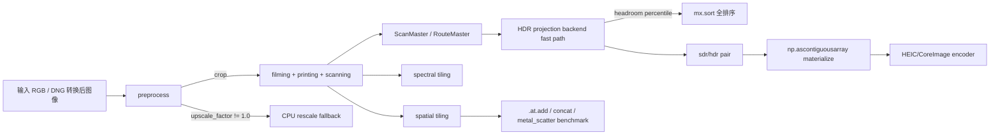
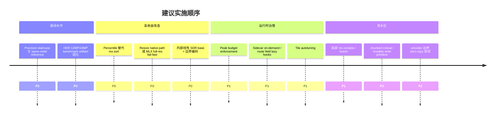

# spektrafilm 中 MLX 加速架构全面审查与可执行改进文档

## Executive summary

这套 MLX 加速架构已经从“能跑 GPU”推进到了“关键 HDR 路径可后端驻留、全分辨率可分块、部分导出边界明确”的阶段，方向是对的，而且最近两组提交把真正影响 12MP/24MP 的问题点抓得很准：RouteMaster sidecar 缩减、projection backend fast path、tile assembly 实测、resize fallback 显式打点，这些都已经把“靠直觉优化”变成了“可测量优化”。citeturn24view1turn9view4turn43view0turn29view0

但如果按“下一轮最值得做什么”来排序，我的判断是：**P0 不是再去碰 `.at.add` 默认策略**，因为现有 12MP/24MP 基准只证明了 `concat` 平均快约 8%，还没过你们自己设的 10% 换默认门槛；真正应该优先打的是三件事：**HDR projection 的 percentile 全排序替代、resize 的 MLX/Apple 原生实现、以及把 HDR fast path 从 `output_cctf_encoding=False` 这个窄条件扩到“内部线性、边界编码”的默认架构**。这三件事更接近现在的主瓶颈，也更能把“backend resident”从局部优化变成默认工作流。citeturn9view4turn9view2turn10view4turn23view0turn43view0

精度方面，现有仓库证据只能支持“**MLX float32 与 CPU float64 的差异大体被 float32 本身解释，未见明显 MLX 特有 bug**”，还不能严格证明“已达理论极限”。原因不是结论错，而是证据链还缺最关键一层：**CPU float32 same-order reference**。当前文档里只有 `CPU f64 → CPU f32 → MLX f32` 的端到端对照，缺少“与 MLX 相同运算顺序、相同 clamp / reduction / pow/log 语义”的 CPU f32 参考，因此“理论极限”这个命题现在还不能被严格证明，只能说“高度怀疑已经接近 float32 上限，尤其是 halation IIR 主导误差时”。citeturn34view0turn31view0turn15search3turn14search1

内存方面，架构已经有正确的抓手：`materialize_policy`、`hdr_route_sidecar_policy`、spectral/spatial tiling、projection backend resident、最终 HEIC pair materialize 边界；但**默认值仍然偏保守**，尤其 `materialize_policy` 默认还是 `numpy_float64`，这意味着如果用户没有显式切到 `backend`，很多 MLX 收益会在最后一跳被吞掉。下一轮最值得做的是把“内存治理”从几个离散选项变成**统一预算控制**：sidecar lazy materialize、route field on-demand、peak budget enforcement、approximate percentile、resize native path、以及可回滚的 safe path 切换。citeturn22view0turn24view1turn27view0turn21view5turn34view5

## 当前架构现状与我对问题边界的判断

先把现状说清楚。仓库当前的后端选择逻辑明确规定：GPU 后端只支持 `float32`，如果请求 `float64`，要么显式报错，要么在 `auto` 下退回 CPU `NumpyBackend`；因此你要评估“MLX float32 相对 CPU float64 的误差是否达极限”，本质上必须把 **CPU float32** 作为中间参考层，而不能只拿 CPU float64 做单点对比。这个架构约束不是论文问题，是仓库自己写死的运行时约束。citeturn31view0turn31view2

运行时参数上，当前默认 `materialize_policy` 仍是 `numpy_float64`，`hdr_route_sidecar_policy` 默认是 `minimal`，并且已经暴露了 `gpu_tile_rows`、`gpu_spatial_tile_rows`、`gpu_disable_spectral_tiling`、`gpu_disable_spatial_tiling` 这些控制项。这说明仓库已经具备“按工作负载调性能/内存”的参数面，但默认行为仍偏向安全与兼容，而不是完全压榨 MLX residency。citeturn22view0turn22view2turn22view3turn22view4

tiling 的基础实现也比较清楚：`process_rows_tiled()` 和 `process_spatial_rows_tiled()` 都已经落地，spectral tile 默认是 `max(256, height // 8)`，spatial tile 默认是 `max(512, height // 8)`；spatial tiling 只在 **MLX + float32** 下启用，并要求 tile rows 至少是 overlap 的 4 倍，以控制 halo 开销。更关键的是，当前 `_write_tile()` 在 MLX 下确实是通过 `output.at[y0:y1].add(tile_out)` 回写，因为 MLX 数组语义不可变。citeturn42view0turn42view1turn42view2turn42view3turn42view4

你们最近补的 tile assembly benchmark 很重要，因为它给了一个非常清晰的结论：**`concat` 是 aggregate winner，但没有过换默认的门槛，所以 `.at.add` 保持默认是合理的。** 已提交报告里，12MP aggregate median-of-medians 从 `0.0623s` 到 `0.0570s`，提升约 `8.39%`；24MP 从 `0.1021s` 到 `0.0939s`，提升约 `7.97%`；两档都没达到 10% 的 wall-clock gate，而且 parity 为 0、峰值内存基本持平，因此“先不改默认”是审慎且正确的决定。报告同时还指出 `metal_scatter` 在当前 MLX 自定义 kernel 模型下不可行，因为不能安全地对已有 full-frame output 做原地写入。citeturn9view4turn11view0turn11view1

HDR 路径上的进展也已经实打实落地。`projection.py` 里有 `_percentile_backend()`，现在 headroom 仍然通过 `mx.sort(flat)` 做分位数；backend fast path 会把 `projection_backend` 标为 `"mlx"`，并把 `projection_metadata_statistics` 标为 `"omitted_backend_fast_path"`，避免为统计信息触发 full-frame readback。另一方面，`output_cctf_encoding=True` 仍会让 `_sdr_rgb_backend()` 返回 `None`，从而走回 NumPy/colour 路径；测试也明确验证了在 `output_cctf_encoding=True` 时结果是 `np.ndarray`，而且不会记录 `projection_backend`。这意味着 HDR projection 的 backend resident 现在是“真实存在，但条件仍比较窄”的状态。citeturn9view2turn9view3turn10view4turn21view0turn21view1

导出边界也已经很明确：`export_hdr_heic_from_simulator()` 先 `render_hdr_pair_from_master()`，然后在交给 `save_hdr_photo_heic_from_pair()` 之前，明确用 `np.ascontiguousarray(result.sdr_rgb)` 和 `np.ascontiguousarray(result.hdr_rgb)` 做最终 materialize。这个边界本身没有问题，相反它把“GPU 驻留”与“CPU/HEIC 编码”分层得很干净；但这也意味着如果要继续压 HDR export 的总时间，不能只盯 projection 本身，还要看 pair materialize 与 encoder 边界。citeturn27view0turn27view1turn19view5

最后一个非常关键、而且现在还是真断点的地方，是 preprocess resize。`_backend_crop_and_rescale()` 在 `io.upscale_factor != 1.0` 时，直接 `to_numpy(image)` → `skimage.rescale(order=3)` → `backend.asarray(image_np)`，并且会在 MLX + `materialize_policy="backend"` 时额外打上 `SimulationPipeline.preprocess.resize_breaks_backend_residency`。这不是“可能有点慢”，而是确定会打断 GPU 驻留的 CPU 断点。citeturn43view0turn22view5turn23view0

下图是我对现状的简化理解。它不是重新描述整个 pipeline，而是把接下来最值得优先动手的位置标了出来。上述关系来自当前 `pipeline.py`、`tile_utils.py`、`projection.py`、`routemaster_export.py` 以及最近的 benchmark/report。citeturn43view0turn42view1turn9view2turn27view0



## 加速效果审查与优先级路线

### 我的总体判断

如果把“全分辨率 12MP/24MP scan”与“打开 HDR 后的性能”合在一起看，我认为当前最该优先推进的不是泛泛的“再做 fusion”，而是把已有 fast path 的 **覆盖面、同步点、以及 percentile 复杂度** 先处理掉。原因很简单：仓库现在已经有不少局部 GPU 优化，但真正限制到端到端收益的几个问题都非常具体——`output_cctf_encoding=True` 会让 projection fast path 失效，headroom percentile 仍是 `mx.sort` 全排序，resize 一旦开启就会 CPU round-trip，而 tile 默认策略虽然不是最优，也还没有坏到足以抢过前面三件事的优先级。citeturn10view4turn9view2turn43view0turn9view4

历史基线方面，仓库自己的 2026-05-30 优化报告给过一个 12.6MP 全流程结果：CPU float64 约 `8.6s`，MLX float32 约 `5.6s`，计时还包含了最终 GPU→CPU 拷贝；同时文档把当前收益主要归因于 LUT、数据驻留、减少中间转换等优化。这个 historical baseline 对“scan 热路径已经不再是百秒级灾难”很有参考价值，但它不是今天 HDR pair export 的充分答案，所以我建议把它当旧基线，而不是当现状最终结论。citeturn9view6turn34view5

### 建议优先级总表

下表是我建议的优先级排序。收益区间是**工程估计**，不是已测结果；我尽量把估计限制在与当前代码和官方文档一致、且容易被 benchmark 证伪的范围内。citeturn9view2turn9view4turn43view0turn32search1turn32search4

| 优先级 | 项目 | 代码定位 | 预期收益 | 难度 | 主要风险 | 必做验证 | 依据 |
|---|---|---|---:|---|---|---|---|
| P0 | 把 HDR fast path 从“仅线性 SDR base”扩成“内部线性、边界编码”默认架构 | `src/spektrafilm/hdr/projection.py` `_sdr_rgb_backend()` 约 L2455-L2467；`src/spektrafilm/runtime/params_schema.py` `IOParams.output_cctf_encoding=True` 默认；测试 `tests/test_hdr_projection_backend.py` 中 `output_cctf_encoding=True` fallback | HDR projection / export 总时间约 5%–15%；覆盖率提升大于单点提速 | 中 | 视觉回归、metadata 语义回归 | 12MP/24MP HDR export wall-clock、pair parity、metadata parity、backend residency | citeturn10view4turn21view1turn23view0turn27view0 |
| P0 | 用 approximate percentile / selection 替代 `mx.sort` 全排序 | `src/spektrafilm/hdr/projection.py` `_percentile_backend()` 约 L2558-L2607 | HDR projection stage 10%–30%，极端大图更高 | 中 | headroom 偏差、gain-map 语义漂移 | 12MP/24MP percentile timing、headroom diff、gain-map ΔEV 分布、HEIC 视觉 spot check | citeturn9view2turn29view2turn15search4turn16search5turn17search4 |
| P0 | 实现 Apple 原生 resize，消除 preprocess CPU fallback | `src/spektrafilm/runtime/pipeline.py` `_backend_crop_and_rescale()` 约 L3429-L3504 | 开启 upscale 时通常是数量级收益；不开启时收益为 0，但能消除 residency 断点 | 中到高 | 插值 parity、Apple-only 依赖 | resize parity、residency checks、12MP/24MP export upscale benchmark | citeturn43view0turn13search0turn13search12turn13search4turn13search11 |
| P1 | tile_rows autotuning，替代当前 `height // 8` 静态启发式 | `src/spektrafilm/gpu/kernels/tile_utils.py` `default_tile_rows()` / `default_spatial_tile_rows()`；`src/spektrafilm/runtime/stages/scanning.py` `_resolve_tile_rows()` | 个别几何形态 10%–25%；aggregate 通常 3%–10% | 低到中 | 参数爆炸、CI 波动 | 12MP/24MP 多宽高比矩阵 benchmark；至少比较两种 `tile_rows` | citeturn42view3turn42view4turn19view2turn11view0turn11view1 |
| P1 | 在纯张量热路径上尝试 `mx.compile()` / 局部 fusion | projection 热函数、spectral 变换热函数、部分 filter 组合点 | 热路径 5%–15%，有时还能减内存 | 中 | shape 约束、debug 难度、compile 边界条件 | 相同 shape 的稳定 benchmark、graph size / peak memory、功能 parity | citeturn32search1turn12search0turn32search8turn19view8 |
| P1 | 减少不必要 sync，探索 `async_eval` 和 streams 组织 | `src/spektrafilm/gpu/mlx_backend.py` `eval()/to_numpy()/cleanup()`；tiling 中 `eval_per_tile=True`；导出边界 | 总时间 3%–8%，主要靠减少 host stall | 中 | 隐式同步 bug、时序不稳定 | sync 点计数、wall-clock、结果确定性、重复运行方差 | citeturn19view8turn42view4turn32search2turn32search3turn32search4 |
| P1 | 让 HDR benchmark 常态化，补齐 12MP/24MP 结果工件 | `tests/benchmarks/benchmark_hdr_projection_backend.py` | 0% 直接提速，但能避免误判优先级 | 低 | CI 变慢 | JSON/Markdown artifact、固定输入、版本化结果 | citeturn29view0turn29view2 |
| P2 | 重新研究 tile assembly 写回原语 | `src/spektrafilm/gpu/kernels/tile_utils.py` `_write_tile()`；benchmark harness | 可能 5%–10%，但当前证据不够 | 高 | 后端原语不足、维护成本高 | 12MP/24MP wall-clock、peak memory、graph length 指标 | citeturn42view1turn9view4turn11view0 |
| P2 | encoder 前移 / zero-copy pair export | `src/spektrafilm/hdr/routemaster_export.py` `export_hdr_heic_from_simulator()`；`src/spektrafilm/utils/hdr_photo.py` `save_hdr_photo_heic_from_pair()` | 若 encoder 成为瓶颈可有 3%–8%；否则很有限 | 高 | Apple CoreImage/HEIF 接口复杂、可移植性差 | pair export timing 拆分、内存峰值、文件 parity | citeturn27view0turn19view5 |

### 我认为最值得立刻推进的几项

**第一项是内部线性 SDR base。** 当前 `output_cctf_encoding=True` 会让 `_sdr_rgb_backend()` 失效，而 `IOParams.output_cctf_encoding` 默认就是 `True`。这意味着即使你们已经把 RouteMaster projection 做到了 backend resident，只要输出策略还是“早编码”，就会把 fast path 的适用面压得很窄。最合理的改法不是强迫用户改配置，而是把“内部线性、最终边界编码”做成 HDR projection/export 的默认内部语义，对外再保持结果一致。citeturn10view4turn21view1turn23view0turn27view0

**第二项是 percentile 替代。** `projection.py` 里 `_percentile_backend()` 直接 `mx.sort(flat)`，而 MLX 官方文档说明 `mlx.core.sort` 返回排序副本，且排序是稳定的；这对正确性没有问题，但在 12MP/24MP 下做 headroom percentile，本质上是为了一个标量去做全量排序，复杂度和图大小都偏重。仓库已经加了 `SPEKTRAFILM_HDR_PROJECTION_PROFILE` 以及 percentile timing 的 benchmark harness，这正好给 approximate histogram、sampled percentile 或 blockwise selection 提供了非常明确的插桩点。Apple 的 MPS 本身也提供 histogram/statistics 相关 kernel，所以这条路在 Apple 平台是现实可行的。citeturn9view2turn29view0turn29view2turn15search4turn13search5turn13search26turn16search5

**第三项是 resize native path。** 这是当前最“干脆”的 residency 断点：不是推测，而是明确的 `to_numpy → rescale → asarray`。如果 GUI 或 export 场景里允许 upscale，这条路径会直接破坏 backend resident。Apple 平台上可以优先考虑 MPSImageBilinearScale / MPSImageLanczosScale，或者更偏 CPU-SIMD 的 `vImageScale_ARGBFFFF`；非 Apple 平台则可以留在 safe path，或者以后转向 CuPy / CUDA / oneAPI 的图像 resize 原语。citeturn43view0turn13search0turn13search12turn13search4turn13search11turn31view2

**第四项是 tile_rows autotuning。** 你们当前默认策略只看 `height // 8`，这作为第一版很合理，但 benchmark 已经说明单个分辨率内不同 `tile_rows` 的差距并不小：比如 24MP spectral `at_add` 从 `tile_rows=256` 的 `0.0894s` 到 `2048` 的 `0.0739s`；24MP spatial `concat` 里 `64×1024` 也明显优于 `128×256`。这说明“默认 heuristics 没坏，但也不是接近最优”。我不建议把默认值拍脑袋改成某个新常数，而是建议做非常轻量的冷启动 autotuning 或按几何形态查表。citeturn11view0turn11view1turn42view3turn42view4

**第五项才是 compile/fusion。** 这件事值得做，但不应该排在 percentile 和 resize 前面，因为 compile/fusion 的收益高度依赖 shape 稳定、控制流简洁、以及 backtrace/debug 可接受。MLX 官方文档明确说 `compile()` 可以通过合并公共计算与 fusion 来缩小图、改善 runtime 和内存；这与当前大量逐步构图、局部 `eval` 的风格是匹配的。不过我建议只在纯张量、shape 稳定、已有 benchmark 的小范围里试，比如 projection hot path、某些 spectral conversion 热函数，而不是先拉全整个 pipeline。citeturn32search1turn12search0turn32search8

## 精度审查与理论极限判据

### 先说结论

以仓库现有证据看，我会把当前精度结论写成一句更严格的话：**“MLX float32 的主要误差来源大概率已经不是 MLX 后端实现，而是 float32 本身与 halation / IIR / 非线性链路的数值特性；但‘是否达到理论极限’目前仍未被严格证明。”** 这不是文字游戏，而是因为仓库现在还缺少最关键的对照层：**CPU float32 same-order reference**。citeturn34view0turn31view0

现有报告给出的 12MP 端到端结果是：`MLX f32 vs CPU f64` 的 PSNR 约 `53.5 dB`，`CPU f32 vs CPU f64` 的 PSNR 约 `53.4 dB`，两者几乎重合；报告据此判断差异主要来自 float32 halation IIR 累积误差，而非后端实现 bug。这个判断我认为方向上是可信的，但它最多只能证明“MLX 没明显更差”，还不能证明“已经逼近理论极限”，因为 CPU f32 仍可能与 MLX f32 在运算顺序、fusion、reduction 次序、pow/log 实现上不同。citeturn34view0turn34view4

### 为什么 CPU f32 same-order reference 是必须项

只要 GPU 后端被限定为 float32，那么“理论极限”讨论就不该围绕 CPU float64，而应该围绕“**同一精度、同一求值顺序、同一函数语义**”的参考实现。NumPy 文档明确提醒：浮点求和的精度会受求和次序影响，而 `sum` 往往采用 partial pairwise summation 改善精度；Higham 对 pairwise summation 的分析也说明 reduction 次序会显著改变误差界。也就是说，只要 MLX 与 NumPy 的 reduction / op scheduling 不同，你就不能把它们的差异都归因为“MLX 没达到极限”。citeturn15search3turn15search8turn14search1turn14search6

因此，严格路径应该是这五层：

| 层级 | 目的 | 是否已有 |
|---|---|---|
| CPU float64 reference | 给出高精度端到端上界 | 已有 |
| CPU float32 same-order reference | 排除精度类别之外的执行顺序差异 | 未系统化 |
| MLX float32 unfused | 观察仅后端算子语义差 | 部分可做 |
| MLX float32 fused / compiled | 观察 fusion 带来的额外偏差 | 未系统化 |
| MLX float32 LUT path | 衡量 LUT 量化误差叠加 | 部分已有历史文档，未自动化 |

这五层的必要性来自仓库现有精度报告、GPU 后端 float32 约束，以及数值分析对 reduction order 的结论。citeturn34view0turn31view0turn15search3turn14search1

### 我建议怎么做 CPU float32 same-order reference

最实用、也最不容易失真的办法，不是到处手写 `astype(np.float32)`，而是做一个**NumpySameOrderFloat32Backend**，它的 API 尽量模仿当前 `ArrayBackend` 子集，让热路径先跑在这个后端上。核心原则有四个。

第一，**每个原语操作后都显式回到 `np.float32`**。包括 `add/mul/div/max/min/clip/where/log/log2/pow/einsum/reduce` 等，否则 NumPy 会因为某些常量或中间类型自动提升精度。第二，**reduction 的 axis、chunking 与 combine 顺序要和 MLX 路径尽量一致**；如果 MLX 热路径里使用 tile/reduce，就让 CPU f32 reference 保持同样的 tile 分块。第三，**clamp、epsilon、pow/log 的入参与常量也要统一成 float32 字面量**，不要让 Python `float` 暗中升到双精度。第四，**对于已经存在 backend fast path 的函数，尽量通过同一套“backend 原语封装”走两边，而不是维护两份数学逻辑。** 这能显著降低“reference 自己写歪”的风险。上述要求都直接来自当前仓库后端抽象、projection 的 float32 常量写法，以及 MLX 的 lazy/compiled 图执行方式。citeturn31view2turn9view2turn10view4turn32search1

下面这一段伪代码可以直接作为工程起点。它不是完整实现，但已经把“same-order reference”最关键的动作约束写出来了。它的设计依据是仓库当前 `backend` 抽象与 MLX 端 fast path 使用的 `float32` 常量风格。citeturn31view2turn9view2turn19view8

```python
# src/spektrafilm/testing/numpy_same_order_backend.py
from __future__ import annotations
import numpy as np

F32 = np.float32

class NumpySameOrderFloat32Backend:
    name = "numpy_same_order_f32"
    precision = "float32"
    supports_gpu = False
    default_dtype = np.float32

    def asarray(self, x, dtype=None):
        return np.asarray(x, dtype=(dtype or np.float32), order="C")

    def zeros(self, shape, dtype=None):
        return np.zeros(shape, dtype=(dtype or np.float32))

    def eval(self, *values):
        return None  # eager backend

    def to_numpy(self, x):
        return np.asarray(x, dtype=np.float32, order="C")

    def clip(self, x, a, b):
        return np.clip(np.asarray(x, np.float32), F32(a), F32(b)).astype(np.float32, copy=False)

    def where(self, cond, x, y):
        out = np.where(cond, np.asarray(x, np.float32), np.asarray(y, np.float32))
        return out.astype(np.float32, copy=False)

    def log2(self, x):
        return np.log2(np.asarray(x, np.float32)).astype(np.float32, copy=False)

    def pow(self, x, exponent):
        # exponent must be float32 too
        return np.power(np.asarray(x, np.float32), F32(exponent), dtype=np.float32).astype(np.float32, copy=False)

    def einsum(self, subscripts, *ops):
        ops = [np.asarray(op, np.float32) for op in ops]
        return np.einsum(subscripts, *ops, optimize=True).astype(np.float32, copy=False)
```

### 要收集哪些误差指标，以及怎么自动化

我建议把误差指标分成四层，而不是只盯 PSNR。

第一层是**逐像素数值误差**：`max_abs_diff`、`mean_abs_diff`、`RMSE`、`PSNR`。这层和你们已有历史文档兼容，可以继续保留。第二层是**感知与亮度相关误差**：`ΔE2000`、`ΔY`、以及 HDR gain-map 的 `ΔEV`。第三层是**浮点语义误差**：ULP histogram、relative error histogram、monotonicity violations。第四层是**结构性误差**：对 IIR/FFT filter 的误差热图、行列边界热图、tile seam 热图。只有把这四层都打齐，“已达理论极限”才有证据基础。上述分类与当前 HDR/gain-map 代码结构、现有 PSNR 报告、以及 Python/NumPy 对 ULP 与 nextafter 的支持相匹配。citeturn34view0turn15search0turn15search1turn15search16

仓库里的落地位置我建议这样分：

| 文件 | 作用 | 说明 |
|---|---|---|
| `src/spektrafilm/testing/float32_reference_backend.py` | same-order backend | 只做 backend 原语，不掺具体业务 |
| `tests/benchmarks/benchmark_precision_staircase.py` | 五层阶梯 benchmark | 输出 JSON/Markdown artifact |
| `tests/test_precision_metrics.py` | 指标函数单测 | ULP、relative error、gain-map ΔEV、单调性 |
| `tests/test_precision_staircase_hdr.py` | HDR 专项精度回归 | light_table / paper / chemical fallback 分开测 |
| `docs/reports/precision-staircase-*.md` | 固定格式报告 | 可直接进入 PR artifact |

指标实现上，ULP 建议基于 `nextafter` / `spacing` 或直接 bit reinterpret；relative error 需要对近零值设置 guard；gain-map ΔEV 直接在 log2 增益域统计最自然。这些做法都可以用现有 Python/NumPy 官方接口完成。citeturn15search1turn15search16turn15search0

### 数值稳定性改进应该怎么取舍

如果实验表明误差主要集中在 **大规模 reduction**，那最值得试的是 **pairwise summation** 或局部 **Kahan/Neumaier compensated summation**。Higham 的分析表明 pairwise summation 能把误差增长从线性级别显著压下来，而且比 Kahan 更适合并行；NumPy 自己也在不少 `sum` 场景里使用 partial pairwise summation。对 spektrafilm 来说，这最可能影响的是某些 luminance / histogram / block reduction 类代码，而不是所有逐元素链路。citeturn14search1turn14search6turn15search3

如果误差主要来自 **IIR / FFT spatial filter**，那么重点不在 Kahan，而在**reduction reordering、分块 combine 顺序固定、以及把有条件的局部归约放到 pairwise combine**。因为 IIR 链路的误差不只是简单求和，还包含状态传播；你们自己的历史文档已经把 halation IIR 认定为主要误差源，所以这部分应该优先做“误差归因实验”，而不是先上昂贵补偿算法。citeturn34view4

如果误差主要来自 **pow/log 非线性**，那首选不是 stochastic rounding，而是**固定输入域、统一 epsilon、避免 CPU/MLX 在 clamp 位置上有一位之差**。stochastic rounding 对某些长链乘加能改善偏差，但它会削弱复现性，而且当前仓库与 MLX 表面接口都没有把它作为自然原语暴露出来，所以我建议只在文档里列为“理论备选”，不作为近期实现方向。这个判断来自当前仓库的可维护性要求与 MLX 官方公开接口。citeturn9view2turn32search0turn32search15

### 我建议采用的“理论极限”判据

我建议把“已达理论极限”拆成三个必须同时满足的条件，而不是一句 PSNR 够高就算数。

第一，**同顺序比较成立**。也就是 `CPU f32 same-order` 与 `MLX f32 unfused` 的差异必须显著小于它们各自对 `CPU f64` 的差异，否则你不能说误差已被 float32 主导。第二，**pointwise / LUT / gain-map 这类局部算子必须接近 ULP 级别**：例如 99.9% 像素落在 0–2 ULP，最大尾部有解释。第三，**端到端 HDR 指标稳定**：例如 PSNR 不低于当前历史基线、gain-map `ΔEV` 的 P99 落在一个很窄的工程阈值内、并且不存在单调性违例。这里我不建议现在就写死绝对阈值数字，而是建议先把历史最佳 run 自动落盘，再用“相对历史最优 + 理论 ULP 层级分析”共同判定。这样既避免拍脑袋，也更适合仓库现状。citeturn34view0turn15search1turn15search16turn15search3

换句话说，**证明“已达理论极限”** 的路径是：  
`CPU f64` 与 `CPU f32 same-order` 差很多，`CPU f32 same-order` 与 `MLX f32 unfused` 差很少，`MLX f32 fused` 与 `MLX f32 unfused` 差也很少，并且这些差异主要集中在已知非结合性区域。  
**反驳“已达理论极限”** 的路径则是：  
在同顺序对照下，MLX 仍持续出现超出 CPU f32 same-order 的结构性偏差，例如某个 pow/log、某个 reduction、某个 percentile 或某个 tile seam 有固定方向误差。citeturn14search1turn15search3turn34view0

## 内存占用审查与优化路线

### 当前内存治理已经有的能力

你们已经做对的事情不少。`hdr_route_sidecar_policy="minimal"` 会在构建 RouteMaster 时只保留核心字段，把 `route_xyz`、`density_cmy`、`route_look_chroma`、`material_detail_y` 这类 sidecar 留空；只有 `full` 策略才强制 materialize 更完整的 sidecar。这个设计已经很接近“按需携带元数据”的正确方向。citeturn24view1turn22view1

tiling 也已经开始真正影响峰值内存，而不仅是时间。`tests/test_spatial_tiling.py` 里已经显式用 `mx.reset_peak_memory()` / `mx.get_peak_memory()` 验证 tiled diffusion 的 peak 小于 non-tiled；tile assembly benchmark 也把 12MP/24MP 的 `peak_memory_max_mib` 固化到报告里。这意味着你们不是在“猜测 MLX 内存会不会降”，而是已经有了采集峰值内存的测试与工件路径。citeturn21view5turn9view4turn29view2

从历史优化报告看，direct spectral path 的内存上界仍然很值得警惕。报告对 12MP 的估算里，单个 `density_spectral` 或 `light` 张量就约 `3.888 GB`，两者短时共存就是 `7.8 GB`，再加上其他中间体和框架开销，峰值估算接近 `9.5 GB`；相对地，LUT 模式可把峰值估算降到约 `2.5 GB`。这些数字应该看作“历史 worst-case 量级”，而不是今天每个路径的现状，但它们足够说明：全链路内存治理仍然有很大工程价值。citeturn34view5

### 最值得做的内存优化项

| 优先级 | 项目 | 代码定位 | 预期收益 | 难度 | 风险 | 依据 |
|---|---|---|---:|---|---|---|
| P0 | sidecar 更细粒度 lazy materialize / on-demand API | `src/spektrafilm/runtime/pipeline.py` `_build_route_master()`；`src/spektrafilm/runtime/route_master.py` | HDR 路径常驻内存 5%–20% | 中 | API 复杂化、调试路径变难 | citeturn24view1turn10view9 |
| P0 | runtime peak budget enforcement | `params_schema.py` 新增预算参数；`pipeline.py` 在 preprocess / filming / printing / scanning 决策 | 防 OOM、自动切 tiling/LUT/fallback，收益主要体现在大图稳定性 | 中 | 策略误判导致性能波动 | citeturn22view0turn21view5turn34view5 |
| P1 | chunked concat with streaming free，替代一次性 tile list | `gpu/kernels/tile_utils.py`；`benchmarks/benchmark_mlx_tile_assembly.py` | 降 graph 长度和某些峰值 | 中 | 代码复杂度上升 | citeturn42view1turn11view0 |
| P1 | backend / Python 层临时 buffer reuse 池 | 热路径 filters / projection / grain | 5%–15% 峰值内存 + 少量 wall-clock | 中到高 | 资源生命周期 bug | citeturn12search8turn12search5turn19view8 |
| P1 | approximate percentile 替代全排序 | `projection.py` `_percentile_backend()` | projection peak memory 与 runtime 同时下降 | 中 | headroom 语义偏差 | citeturn9view2turn16search5turn17search4 |
| P1 | resize native path | `pipeline.py` `_backend_crop_and_rescale()` | 消除 resize round-trip 与断点 | 中到高 | parity 容差控制 | citeturn43view0turn13search0turn13search11 |
| P2 | 自定义可写输出原语或后端 mutable buffer | `_write_tile()` 与 MLX/Metal backend | 可进一步缩短 update graph | 高 | 当前 MLX 原语不直接支持 | citeturn42view1turn11view0 |

### 我最推的两件事

**sidecar lazy materialize / on-demand hook** 很值得做，而且比“盲目继续压缩 sidecar 字段”更稳。当前 minimal sidecar 已经证明你们愿意为 residency 放弃部分非关键字段；下一步最合理的不是继续删，而是让 `route_xyz`、`route_look_chroma`、`material_detail_y` 这类字段在第一次访问时才计算，并可选择返还 numpy 或 backend resident 版本。这样能把“内存优化”变成 API 层特性，而不只是一次性的 if/else。citeturn24view1turn10view9

**peak budget enforcement** 也应该尽快补上。你们已经有 `gpu_tile_rows`、`gpu_spatial_tile_rows`、tiling 开关、LUT 路径、materialize policy、cache cleanup、以及 MLX peak memory 采样，这意味着技术积木是齐的，缺的是统一策略。我的建议是新增一个运行时预算，例如 `gpu_peak_budget_mb`，然后在 preprocess、printing、scanning、HDR projection 进入热路径前，以图像尺寸、是否 LUT、是否 HDR、是否 upscale、是否 backend policy 为输入，选择不同执行计划。这样做的好处不是“把每个 case 都调快”，而是让 24MP+HDR+upscale 这类组合不至于突然越界。citeturn22view0turn43view0turn21view5turn34view5

### 关于 Apple/MLX 专有建议与替代方案

下面这些建议高度依赖 Apple/MLX 特性：`mx.compile()`、`async_eval`/streams、MPS histogram、MPS image scaling、vImage resize、CoreImage/HEIC 边界优化。它们在 Apple 平台上都合理，因为 MLX 官方文档已经提供了 compile、streams、synchronize / eval 这些执行模型接口，Apple 官方文档也提供了 MPS 的 image scale、histogram、statistics 与 vImage scaling 原语。citeturn32search1turn32search2turn32search4turn13search0turn13search5turn13search26turn13search11

如果环境不是 Apple/MLX，我建议保留相同的**测试与 benchmark 框架**，但把实现换成对应平台原语：在 CUDA 上优先用 CuPy/CUB 的 histogram / selection / scan 类原语，在 oneAPI / SYCL 上用相似的并行 histogram / reduction 库；仓库的 `select_backend()` 已经把 `cupy`、`cuda`、`halide` 都作为合法后端名暴露出来，因此 benchmark 和 regression harness 完全可以保持不变，只替换底层实现。citeturn31view2turn17search3turn17search4

## 基准与验证方案

### 你们现在就能跑的 benchmark

tile assembly 现有 harness 已经够用了，应该继续沿用。它至少已经证明了两件事：一是可以同时比较三种拼接策略；二是可以在 12MP/24MP 下把 wall-clock、peak memory、parity 一次打全。现有 HDR projection benchmark 也已经支持 `--height/--width/--runs/--warmups/--modes`，并且会把 `percentile sort total`、`MLX peak memory`、`MLX cache memory` 与 `metadata stats` 一起输出到 Markdown。citeturn29view0turn29view2turn9view4

建议的命令先用现有脚本，不要一开始就重写：

```bash
# tile assembly 现有基准（示意）
.venv/bin/python benchmarks/benchmark_mlx_tile_assembly.py

# HDR projection 现有基准
.venv/bin/python tests/benchmarks/benchmark_hdr_projection_backend.py \
  --height 3000 --width 4000 --warmups 1 --runs 5 \
  --output-json docs/reports/hdr-projection-bench-12mp.json \
  --output-markdown docs/reports/hdr-projection-bench-12mp.md
```

这些命令格式直接来自仓库脚本本身。citeturn29view0turn29view2

### 我建议补齐的统一结果格式

为了把 scan / HDR / memory / sync 统一起来，我建议新增一个长表格式，至少包含这些列：`scenario`、`mp`、`backend`、`materialize_policy`、`hdr_mode`、`tile_strategy`、`tile_rows`、`wall_median_ms`、`wall_p90_ms`、`peak_mib`、`cache_mib`、`sync_points`、`residency_breaks`、`parity_max_abs`、`notes`。这套格式与现有 tile benchmark 和 HDR benchmark 输出字段是一致的，只是把二者合并并加上 sync/residency。citeturn9view4turn29view2turn43view0turn21view0

下面这个模板就是我建议直接采用的表头。它满足你要求的“比较三种拼接策略与至少两种 tile_rows 策略”，而且能自然扩展到 HDR / resize / same-order precision benchmark：

```markdown
| scenario | mp | backend | hdr_mode | tile_strategy | tile_rows | overlap | wall_median_ms | wall_p90_ms | peak_mib | cache_mib | sync_points | residency_breaks | parity_max_abs | notes |
| --- | ---: | --- | --- | --- | ---: | ---: | ---: | ---: | ---: | ---: | ---: | ---: | ---: | --- |
| scan_spectral | 12 | mlx_f32 | off | at_add | 256 | 0 | ... | ... | ... | ... | ... | ... | ... | baseline |
| scan_spectral | 12 | mlx_f32 | off | concat | 256 | 0 | ... | ... | ... | ... | ... | ... | ... |  |
| scan_spectral | 12 | mlx_f32 | off | metal_scatter | 256 | 0 | infeasible | - | - | - | - | - | - | current backend limit |
| scan_spectral | 12 | mlx_f32 | off | at_add | 1024 | 0 | ... | ... | ... | ... | ... | ... | ... | alt tile_rows |
| scan_hdr_projection | 24 | mlx_f32 | paper | backend_fast_path | - | - | ... | ... | ... | ... | ... | ... | ... | percentile profile on |
```

### sync 点与 residency 的采集建议

MLX 是 lazy evaluation 的，`eval()`、`to_numpy()`、打印标量、乃至 `synchronize()` 都会改变你实际测到的时间分布；官方文档也明确把 `eval()`、`synchronize()`、streams、`async_eval()` 作为执行控制接口暴露出来。因此，你们的 benchmark 不应该只记录 wall-clock 与 peak memory，还应该**把 sync 点计数出来**。最简单的办法是给 backend 包一层 profiling proxy：拦截 `eval()`、`to_numpy()`、`synchronize()`，每次调用累加计数并记 label。这样你才能回答“这次提速是算子更快，还是只是把同步推后了”。citeturn32search2turn32search3turn32search4turn19view8

### 建议的实施顺序

下面这个时间线是我主张的顺序。重点不是排一个“完美甘特图”，而是把依赖关系说明白：**先补 benchmark 与 same-order reference，再动 percentile / resize / internal-linear SDR base，再考虑 compile、buffer pool、encoder 边界。** 这样回滚最容易，CI 也最稳。这个顺序来自当前代码结构和现有 benchmark 覆盖情况。citeturn29view0turn9view4turn43view0turn24view1



## 可直接交给工程师或 Codex 的任务清单

下面这部分我按“可以直接开工”的粒度写。每项都包含定位、修改方向、验证、回滚。行号以当前 `develop` 为准，后续若漂移，优先用我给的函数名和 grep 关键词定位。citeturn24view1turn42view1turn43view0turn29view0

### 任务一

**目标**：补齐精度阶梯，新增 `CPU float32 same-order reference`，把“是否达理论极限”变成可验证命题。citeturn34view0turn31view0

**定位**：  
`src/spektrafilm/gpu/backend.py` 的 backend 抽象与 `select_backend()`；`src/spektrafilm/hdr/projection.py`；`src/spektrafilm/gpu/kernels/*` 的 backend 热函数；新增 `src/spektrafilm/testing/numpy_same_order_backend.py`；新增 `tests/benchmarks/benchmark_precision_staircase.py`。citeturn31view2turn9view2

**修改要点**：  
实现 `NumpySameOrderFloat32Backend`，至少覆盖 `asarray/zeros/eval/to_numpy/clip/where/log/log2/pow/einsum` 与常见 reduction；然后在 benchmark 中跑 `cpu_f64_reference → cpu_f32_same_order → mlx_f32_unfused → mlx_f32_compiled_if_any → mlx_f32_lut` 五层。对 HDR gain-map 单独输出 `ΔEV` 分布，对 projection 输出 headroom / gain-map / SDR/HDR pair 的误差分解。citeturn31view2turn9view2turn27view0

**测试命令**：

```bash
.venv/bin/python -m pytest tests/test_precision_metrics.py -q
.venv/bin/python tests/benchmarks/benchmark_precision_staircase.py \
  --height 3000 --width 4000 --runs 3 \
  --output-json docs/reports/precision-staircase-12mp.json \
  --output-markdown docs/reports/precision-staircase-12mp.md
```

**回滚指令**：  
若 CI 或基准异常，先删新增 benchmark 与 backend 文件，再把任何生产代码中引入的 same-order reference 路由全部撤销，保证生产路径不依赖新 backend。citeturn31view2turn29view0

### 任务二

**目标**：把 HDR projection 的 headroom percentile 从 `mx.sort` 全排序改成可配置的 approximate / sampled / blockwise selection 实现。citeturn9view2turn15search4turn16search5

**定位**：  
`src/spektrafilm/hdr/projection.py` 中 `_percentile_backend()` 约 L2558-L2607；`tests/benchmarks/benchmark_hdr_projection_backend.py`；相关 backend projection tests。citeturn9view2turn29view0

**修改要点**：  
保留当前 `sort_exact` 作为 safe path，新增 `percentile_mode`，至少实现：  
`exact_sort`、`sampled_sort`、`histogram_approx`。默认先不切换，先让 benchmark 选型。对于 histogram 方案，建议先在 `[0, max_headroom_log2]` 上做固定 bin histogram，再在累计分布上求分位；必要时对落入目标 bin 的样本做二次精确排序。Apple/MLX 平台可额外调研 MPS histogram 路径。citeturn9view2turn29view2turn13search5turn16search5

**测试命令**：

```bash
.venv/bin/python -m pytest tests/test_hdr_projection_backend.py -q
.venv/bin/python tests/benchmarks/benchmark_hdr_projection_backend.py \
  --height 3000 --width 4000 --runs 5 --warmups 1 \
  --output-json docs/reports/hdr-proj-percentile-12mp.json \
  --output-markdown docs/reports/hdr-proj-percentile-12mp.md
```

**回滚指令**：  
一旦 `headroom`、`gain_map`、或 `ΔEV` 的 P99 超过预设容差，直接切回 `exact_sort` 默认，并保留 approximate mode 仅供 benchmark 或实验配置使用。citeturn9view2turn29view2

### 任务三

**目标**：消除 preprocess resize 的 CPU fallback；若短期做不到，至少对 MLX full-res export + upscale 做 fail-fast，避免用户误以为仍是 GPU resident。citeturn43view0turn13search0turn13search11

**定位**：  
`src/spektrafilm/runtime/pipeline.py` `_backend_crop_and_rescale()` 约 L3429-L3504；`tests/test_preprocess_resize_backend_residency.py`。citeturn43view0

**修改要点**：  
第一阶段先增加 runtime policy：当 `backend=mlx`、`materialize_policy=backend`、`upscale_factor!=1.0` 时，可选 `warn` / `fail` / `cpu_fallback`。第二阶段实现 Apple 原生 resize：优先一版 `bilinear`，随后补 `lanczos/cubic` parity。Apple 路径可优先评估 MPSImageBilinearScale / MPSImageLanczosScale；如果接入成本过高，可先走 `vImageScale_ARGBFFFF` 作为 CPU-SIMD safe path，并在文档中明确这不算 backend resident。citeturn43view0turn13search0turn13search12turn13search4turn13search11

**测试命令**：

```bash
.venv/bin/python -m pytest tests/test_preprocess_resize_backend_residency.py -q
.venv/bin/python -m pytest tests/test_gpu_pipeline.py -q
```

**回滚指令**：  
保留现有 `cpu_fallback` 路径不动，新实现放在 feature flag 后；如果 parity 或稳定性不过，默认位设置回 `cpu_fallback`。citeturn43view0turn21view3

### 任务四

**目标**：把 HDR backend fast path 从 `output_cctf_encoding=False` 的窄条件扩展到“内部线性 SDR base、最终边界编码”的默认实现。citeturn10view4turn21view1turn23view0

**定位**：  
`src/spektrafilm/hdr/projection.py` `_sdr_rgb_backend()`、`build_hdr_y_from_route` 相关路径；`src/spektrafilm/hdr/routemaster_export.py` `export_hdr_heic_from_simulator()`；`src/spektrafilm/utils/hdr_photo.py` pair encoder 边界。citeturn10view4turn27view0turn19view5

**修改要点**：  
内部统一使用线性 SDR base，让 projection 始终保持 backend resident；如果最终文件或预览需要 CCTF，再在最外层 materialize 边界编码。要同步更新 diagnostics：把“内部线性、边界编码”的语义写清楚，避免用户把中间结果误当最终可显示 RGB。citeturn10view4turn27view0

**测试命令**：

```bash
.venv/bin/python -m pytest tests/test_hdr_projection_backend.py -q
.venv/bin/python -m pytest tests/test_hdr_routemaster_export.py -q
.venv/bin/python -m pytest tests/test_hdr_photo.py tests/test_hdr_curve_profiles.py -q
```

**回滚指令**：  
保留旧分支为 `legacy_encoded_sdr_base`，任何 visual parity 失败都能立即回切。citeturn21view1turn27view0

### 任务五

**目标**：做 tile_rows autotuning，但**不要**改 `.at.add` 默认拼接策略，除非新数据穿过 10% 门槛。citeturn9view4turn11view0turn11view1

**定位**：  
`src/spektrafilm/gpu/kernels/tile_utils.py` `default_tile_rows()` / `default_spatial_tile_rows()`；`src/spektrafilm/runtime/stages/scanning.py` `_resolve_tile_rows()`；`benchmarks/benchmark_mlx_tile_assembly.py`。citeturn42view3turn42view4turn19view2turn11view4

**修改要点**：  
新增一个只依赖分辨率、纵横比、overlap、scenario 的小查表或冷启动 autotune cache。默认 assembly strategy 仍保持 `.at.add`；autotune 只选择 `tile_rows`，不碰拼接策略。冷启动成本要可控，建议只在第一次遇到新 geometry 时跑少量候选。citeturn9view4turn11view0turn42view1

**测试命令**：

```bash
.venv/bin/python -m pytest tests/test_spatial_tiling.py -q
.venv/bin/python -m pytest tests/test_mlx_tile_assembly_benchmark.py -q
.venv/bin/python benchmarks/benchmark_mlx_tile_assembly.py
```

**回滚指令**：  
若 autotune 增加波动或启动开销，保留现有 `height // 8` 作为 fallback，并允许 `gpu_tile_rows` / `gpu_spatial_tile_rows` 显式覆盖。citeturn22view2turn22view3turn42view3turn42view4

### 任务六

**目标**：加统一的 sync / residency / peak-memory profiling proxy，避免只看 wall-clock。citeturn19view8turn32search2turn32search3turn32search4

**定位**：  
`src/spektrafilm/gpu/mlx_backend.py` 中 `eval()`、`to_numpy()`、`synchronize()`、`cleanup()`；benchmark 脚本。citeturn19view8turn19view7

**修改要点**：  
新增一个轻量 profiling wrapper，记录：`eval_count`、`to_numpy_count`、`synchronize_count`、每次 label、耗时、peak/cache memory snapshot。然后在 tile benchmark、HDR benchmark、precision staircase 里统一写进 JSON artifact。MLX 官方接口已经提供 `eval`、`synchronize`、streams 和 `async_eval`，基础能力是现成的。citeturn32search2turn32search3turn32search4turn32search15

**测试命令**：

```bash
.venv/bin/python tests/benchmarks/benchmark_hdr_projection_backend.py --height 3000 --width 4000
.venv/bin/python benchmarks/benchmark_mlx_tile_assembly.py
```

**回滚指令**：  
profiling wrapper 必须是 opt-in；若有任何性能污染或行为变化，直接关闭环境变量或移除 wrapper 注入。citeturn29view0turn9view4

### 任务七

**目标**：把内存治理做成 runtime budget，而不是若干离散开关。citeturn22view0turn34view5turn21view5

**定位**：  
`src/spektrafilm/runtime/params_schema.py`；`src/spektrafilm/runtime/pipeline.py`；可能新增 `src/spektrafilm/runtime/memory_budget.py`。citeturn22view0turn43view0

**修改要点**：  
新增 `gpu_peak_budget_mb`、`gpu_budget_policy`。在 preprocess、printing、scanning、HDR projection 进入热路径前，按图像尺寸、是否 HDR、是否 upscale、是否 direct spectral / LUT、是否 backend output 估算峰值，并自动选择：开启 tiling、缩小 tile_rows、切 LUT、或回退 safe path。12MP 历史 worst-case 量级已经有文档参考，可以先用保守估算，再用实际采样修正。citeturn34view5turn21view5

**测试命令**：

```bash
.venv/bin/python -m pytest tests/test_gpu_pipeline.py -q
.venv/bin/python -m pytest tests/test_spatial_tiling.py -q
```

**回滚指令**：  
预算策略必须是 opt-in 或 soft-enforce；任何“误判导致性能大幅退化”的情况都能通过关闭 `gpu_budget_policy` 立刻恢复旧行为。citeturn22view0turn21view3

### 任务八

**目标**：探索局部 `mx.compile()` / fusion，但只在已经有 benchmark 的纯张量热路径里试。citeturn32search1turn12search0

**定位**：  
优先候选是 `src/spektrafilm/hdr/projection.py` 中一段连续的 backend 数学链，以及 `scanning.py` / `printing.py` 中纯张量 spectral 变换热函数。citeturn9view2turn19view3turn19view0

**修改要点**：  
避免跨越 Python 控制流和外部库边界；先包一层纯函数，shape 固定，输入输出只含 backend arrays 与少量标量。对 একই shape 做 `compiled` 与 `uncompiled` 双 benchmark，比较 wall-clock 与 peak memory。不要一上来试图 compile 整个 pipeline。citeturn32search1turn32search8

**测试命令**：

```bash
.venv/bin/python tests/benchmarks/benchmark_hdr_projection_backend.py --height 3000 --width 4000
.venv/bin/python -m pytest tests/test_hdr_projection_backend.py -q
```

**回滚指令**：  
compile 版本与未编译版本并存，通过 flag 切换；一旦出现 shape 限制或 debug 困难，默认关掉 compile 路径。citeturn32search1turn32search8

### 任务九

**目标**：把 RouteMaster minimal sidecar 进一步升级成 field-level on-demand API。citeturn24view1turn22view1

**定位**：  
`src/spektrafilm/runtime/pipeline.py` `_build_route_master()`；`src/spektrafilm/runtime/route_master.py`。citeturn24view1

**修改要点**：  
为 `route_xyz`、`route_look_chroma`、`material_detail_y` 增加懒计算器或 provider hook，允许按 `numpy` / `backend` 两种 materialize 策略取值。debug path、HEIC metadata path、tests 需要显式声明请求何种版本，防止隐式 readback。citeturn24view1turn9view3

**测试命令**：

```bash
.venv/bin/python -m pytest tests/test_route_master_sidecars.py -q
.venv/bin/python -m pytest tests/test_hdr_projection_backend.py -q
```

**回滚指令**：  
保留当前 dataclass 字段语义不变，只在 access path 外挂 provider；若懒求值引入复杂 bug，可迅速退回当前 minimal/full 二选一策略。citeturn24view1turn22view1

### 任务十

**目标**：仅在 benchmark 充分证明后，再研究 custom mutable write primitive 或 chunked concat，绝不先改 `_write_tile()` 默认。citeturn42view1turn9view4turn11view0

**定位**：  
`src/spektrafilm/gpu/kernels/tile_utils.py` `_write_tile()`；可能的 MLX/Metal backend 扩展层。citeturn42view1

**修改要点**：  
先实现 `chunked_concat` 版本，要求每处理完一组 tiles 就主动 `eval` 并释放前一组，目标是缩短 update graph，而不是强行追求新的默认 assembly 策略。只有当新策略在 12MP/24MP 下同时满足 `>=10%` wall-clock、峰值内存不增、parity=0，才考虑替换默认。citeturn9view4turn11view0

**测试命令**：

```bash
.venv/bin/python benchmarks/benchmark_mlx_tile_assembly.py
.venv/bin/python -m pytest tests/test_spatial_tiling.py -q
```

**回滚指令**：  
新策略必须挂在显式参数或实验开关后；若结果不稳定，直接保持 `.at.add` 默认不动。citeturn9view4turn42view1

## 主要参考来源

本报告优先使用了仓库代码、测试与已提交报告：`docs/gpu/mlx-optimization-report-20260530.md`、`docs/reports/mlx-tile-assembly-benchmark-20260624-200634.md`、`src/spektrafilm/hdr/projection.py`、`src/spektrafilm/runtime/pipeline.py`、`src/spektrafilm/gpu/kernels/tile_utils.py`、`tests/benchmarks/benchmark_hdr_projection_backend.py`、`tests/test_hdr_projection_backend.py`、`tests/test_spatial_tiling.py` 等。对于外部最佳实践，我主要参考了 MLX 官方文档关于 lazy evaluation、compile、streams、eval/synchronize 的说明，Apple 官方关于 MPS image scale / histogram / statistics 与 vImage scaling 的文档，以及数值分析里 Higham 关于 pairwise summation 的经典分析与 NumPy 对 pairwise summation / `nextafter` / `spacing` 的官方说明。仓库内做法可直接借鉴的，是 benchmark artifact、residency checks、exact-vs-fast-path 双轨；不宜直接照搬的，是跨平台假设和“在 MLX 当前原语模型下强行做可写 full-frame scatter”。citeturn9view4turn29view0turn12search0turn32search1turn32search4turn13search0turn13search5turn13search11turn14search1turn15search3turn15search1turn15search16