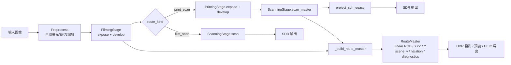
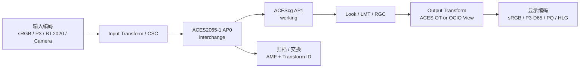

# SpektraFilm 色彩管理系统架构评估与改进报告

## 执行摘要

本报告基于 `develop` 分支的公开代码、测试与文档，对 `21Z121Z1/spektrafilm` 当前色彩管理系统做了面向工程落地的评估。这个分支的核心方向很清楚：保持上游 SDR 胶片模拟为“正确性参考路径”，同时把 Apple Silicon 的 MLX/Metal 加速、RouteMaster 式 HDR 投影、以及更明确的 ACES/场景线性工作流作为扩展能力引入；README 也明确说明，当前 HDR、ACES 预览和加速后端仍带有实验性质，其中 HDR light-table 路线尚未定型，ACES 预览也“不是完整的 OCIO/CTL 级 ACES Output Transform”。citeturn46view1turn46view2turn46view3turn46view0turn43view0

从架构上看，这个仓库已经具备一个很好的基础：`SimulationPipeline` 在预处理阶段记录 `HDRSceneEnergyMetadata`，主流程通过 `FilmingStage`、`PrintingStage`、`ScanningStage` 生成 `ScanMasterResult`，然后再封装成 `RouteMaster`，把 `route_linear_rgb`、`route_linear_xyz`、`route_luminance_y`、`scene_y_raw`、`post_halation_y`、`sdr_legacy_rgb` 和诊断信息保留下来。这意味着系统已经具备“先保留摄影学意义上的场景/材料状态，再派生 SDR/HDR 投影”的正确方向，而不是从一个已经被 SDR 限制过的结果里倒推 HDR。README 对此也明确把 RouteMaster 作为 HDR 工作的长期方向。citeturn26view0turn27view2turn19view0turn46view1

但从你要求的三个角度看，当前实现仍有三个结构性缺口。第一，HDR 目前更像“头顶空间管理 + 路由态保存 + HEIC gain-map 导出实验”，而不是完整的“显示意图驱动 HDR 色彩管理系统”：代码中存在 `hdr_mode = "light_table" | "paper"`、HDR 曲线 profile、`display_white_nits` / `target_peak_ev` 等概念，但仓库内并没有形成显式的 PQ / HLG 传输模块、绝对亮度主控、显示白点适配层、以及标准化的 HDR mastering / viewing profile。citeturn19view0turn23view1turn31view4turn46view1

第二，精度策略已经开始体系化，但还没有完全“架构化”。仓库已经明确规定：GPU 主要走 `float32`，`float64` 会回退 CPU；MLX 后端只允许 `float32` 或 `float16`；CPU 仍然是正确性参考；并且文档已经把不同 kernel 的精度状态分成 `COMPLIANT / CONDITIONAL / NON-COMPLIANT`，把 2D LUT Mitchell cubic 和 JzAzBz gamut compression 标成非完全合规路径。换句话说，问题不是“有没有意识到精度”，而是“还缺一套关键路径双精度、次关键路径补偿求和、非关键路径 float32 的统一分层准则”。citeturn15view0turn15view1turn41view0turn42view0

第三，ACES 兼容性目前是“部分兼容，而非完整兼容”。系统已有 `aces_reference` 工作流预设，输入/输出工作空间可以设为 `ACEScg`，保存空间可以设为 `ACES2065-1`，测试也覆盖了这些预设；但显示预览侧目前使用的是本地的 Stephen Hill ACES fitted SDR preview，而不是官方 ACES Output Transform / OCIO Config；代码中也没有看到完整的 ACES RRT/ODT/ACES 2 Output Transform、AMF / Transform ID、或 OCIO 内建 ACES 2 配置接入。也就是说，它已经有“ACES-aware”的接口，却还没有“ACES-native”的执行链。citeturn31view0turn43view0turn43view1turn46view0turn45search0turn45search3turn45search4turn44search7turn44search11

我的总体判断是：这个仓库当前最值得做的不是零散修 bug，而是把现有能力上升成三层清晰架构。第一层保留现在已经很不错的“场景线性 RouteMaster/ScanMaster 核心态”；第二层独立出“显示意图层”，显式管理目标色域、白点、峰值亮度、CCTF/EOTF、局部高光保护；第三层独立出“标准工作流层”，让 ACES / OCIO / HDR 传输函数成为可替换插件，而不是藏在若干局部函数和测试约束里。这样做既能把 HDR 做完整，也能把 float32/float64 的边界做清楚，还能让 ACES 兼容从“预设级支持”升级到“流程级支持”。citeturn27view2turn36view4turn36view5turn43view0turn45search0turn45search8

## 现状架构评估

当前主流程可以概括为：图像进入 `SimulationPipeline` 后，先在预处理阶段进行自动曝光与缩放，同时记录 `HDRSceneEnergyMetadata`；随后进入 `FilmingStage.expose / develop`；如果是纸路由，则再经过 `PrintingStage` 与 `ScanningStage.scan_master`；如果是扫描胶片路由，则直接扫描；最后由 `_build_route_master` 统一封装出 `RouteMaster`，其中既保存 SDR 旧路径结果，也保存线性 RGB / XYZ / Y 以及用于 HDR 或分析的 sidecar。这个结构比很多只保存“最终图像”的系统要先进得多，因为它天然支持“一次摄影模拟，多种输出投影”。citeturn26view0turn26view1turn27view0turn27view1turn27view2turn19view0



仓库 README 对这条思路也有直接说明：HDR 工作被设计为“先生成共享的 photographic material state，再从该共享状态导出 SDR 和 HDR 投影”，而不是对 SDR 成品做二次 HDR 重建。与这条设计对应，`RouteMaster` 的字段也明确包含 `route_linear_rgb`、`route_linear_xyz`、`route_luminance_y`、`scene_y_raw`、`post_halation_y`、`route_look_chroma`、`material_detail_y` 等，可以看出作者已经在为后续 HDR 投影、局部保护和分析指标留接口。citeturn46view1turn19view0turn27view2

在扫描阶段，系统把光谱链路得到的 `xyz` 经 glare、`XYZ_to_RGB`、输出侧 gamut compression、blur/unsharp、以及 CCTF encode + clip 生成现有 SDR legacy 输出；同时 `ScanMasterResult` 内又保留了未做最终编码/裁切的 `route_linear_rgb`、`route_linear_xyz` 和 `route_luminance_y`。这说明当前系统已经把“材料态”和“显示态”部分拆开了，但拆得还不够彻底：扫描阶段仍然同时承担了部分显示域职责，所以 HDR/ACES 后续接入时，容易在 `ScanningStage` 与独立 display transform 之间边界不清。citeturn36view4turn36view5turn36view3turn36view2

从色彩管理边界看，当前仓库已经把“运行时输出 / 文件保存 / display preview”做了概念分离，这一点在 README 中写得很明确；默认 SDR 仍然是 `sRGB + CCTF + clip`，而场景线性与 ACES 风格工作流则通过更显式的 runtime output encoding / save encoding 来控制。问题在于，这种分离目前更偏“参数分离”，还没有完全上升为“模块分层”：例如预览里已有 ACES 风格 SDR transform，但它不是标准 ACES Output Transform；HDR 导出验证了 HEIC `tmap` 结构，但并未在代码与文档中形成统一的 HDR display profile 对象。citeturn46view0turn46view1turn43view0

因此，现状架构可以给出一个简洁判断：**RouteMaster 方向是对的，显示变换层还不够独立，标准工作流层还不够完整。**这不是“推翻重写”的问题，而是“把现在已经存在的隐式层次显式化”。citeturn19view0turn27view2turn46view1

## HDR 支持评估

当前 HDR 能力的优点，在于它已经从“导出一个 HDR 文件”向“以场景/材料信息为基础的 HDR 投影”迈了一步。README 明确指出，这个分支最有价值的方向是“idealized HDR paper projection”，目标是在保留作者化 SDR print look 附近漫反射白外观的前提下，把“被选中的高光能量”扩展到 HDR 头顶空间里；同时 light-table 路线仍处于 active work。`hdr_curve_profiles.py` 也显示，HDR curve 已经不只是简单拉亮，而是围绕 `look_diffuse_white_reference`、`safe_max_headroom`、`display_white_nits`、`target_peak_ev`、`visual_peak`、`curve_budget_ev` 这些概念组织，并且区分了 deprecated 的 `build_profile_hdr_curve` 与更新的 `build_profile_preserving_hdr_curve`。citeturn46view1turn22view1turn24view0turn23view1turn31view3turn31view4

但如果以“完整 HDR 色彩管理系统”的标准来审视，当前仓库至少有五个明显缺口。第一，运行时没有看到显式的 PQ / HLG 模块，也没有形成“绝对亮度 EOTF/OETF 层”；这意味着 HDR 结果目前更像“场景头顶空间扩展结果”，而不是“明确定义到某类 HDR 显示器的编码结果”。第二，`HDRMode` 目前只有 `light_table` 和 `paper` 两个摄影学语义模式，而不是“显示标准 + 渲染策略”的笛卡尔组合。第三，白点管理没有形成显式适配层，尤其在 ACES D60 和常见 SDR/HDR 显示 D65 的过渡上，当前设计更多依赖 colour-science 默认矩阵和局部转换。第四，局部高光保护/重建没有上升为清晰可配置的算法家族。第五，gain-map 导出路径虽然有 ISO 21496-1 / HEIC `tmap` 结构验证，但结构正确并不等于不同平台显示语义就一定正确。citeturn19view0turn46view1turn46view0turn27view1

从标准角度看，PQ 是基于绝对亮度的 HDR 传输函数，标准化于 SMPTE ST 2084，也被 Rec.2100 采用；HLG 则是 BBC / NHK 提出的相对制式 HDR 传输函数，标准化为 ARIB STD-B67，同样被 Rec.2100 接纳，优势在于更强的广播兼容性。ACES 官方输出变换文档也显示，现代 ACES 输出变换本身已经是“tone scale + chroma compression + gamut compression + display encoding”的完整链路，而不是单一曲线。把这些事实和目前仓库状态叠加后，一个直接结论是：**你现在的 HDR 逻辑更接近“scene-linear HDR projection core”，但还没完全成为“display-referred HDR management system”。**citeturn44search5turn44search6turn45search0

下面这张表可以作为当前与建议方向的对照。

| 维度 | 当前仓库状态 | 风险 | 建议方向 | 优先级 |
|---|---|---|---|---|
| 亮度范围管理 | 已有 `safe_max_headroom`、`target_peak_ev`、`display_white_nits` 等概念，但未形成统一 DisplayProfile | 不同预览/导出语义可能不一致 | 引入 `DisplayProfile(white_nits, peak_nits, black_nits, primaries, white_point, transfer)` | P0 |
| 传输函数 | 仓库内未见显式 PQ/HLG 编码模块；HDR 更偏路由态与投影曲线 | 跨设备一致性弱，测试难以标准化 | 单独实现 `pq_encode/decode` 与 `hlg_oetf/eotf`，并把它们从 RouteMaster 外置 | P0 |
| 白点适配 | 当前依赖 colour-science 色彩空间转换，但无独立白点策略层 | ACES D60 与显示 D65 过渡不透明 | 增加 CAT16 / Bradford / CAT02 适配策略开关，并固定关键路径到 float64 | P1 |
| 高光保护 | 已有 highlight boost、profile-preserving 曲线、material detail sidecar | 容易把局部结构问题塞进全局曲线 | 建立“全局曲线 + 局部 detail map”的两阶段 HDR 投影 | P0 |
| 高光重建 | 当前更偏 headroom graft / budget，而非图像结构重建 | 极亮区域细节可能被平滑吞掉 | 增加基于基底层/细节层或导向滤波的 highlight reconstruction | P1 |
| 局部/全局策略 | 当前偏全局 profile curve | 高反差场景可能出现高光局部洗平、邻域对比不足 | 默认全局、可选局部保护；导出前锁定 monotonic | P1 |

PQ 与 HLG 的取舍也需要显式化。PQ 是绝对亮度映射，适合可控显示链和 still HDR master；HLG 是相对系统，更适合广播与兼容路径。你这个项目当前更像“离线渲染 + still HDR / 实验输出”，因此默认建议其实是 **PQ 为主、HLG 为辅**。如果未来要面向直播/广播或“同一资产兼顾 SDR fallback”，再把 HLG 做成并行 profile。这个判断与 PQ/HLG 的标准属性是一致的。citeturn44search5turn44search6

| 方案 | 优点 | 缺点 | 更适合本仓库的场景 |
|---|---|---|---|
| PQ | 绝对亮度定义清楚，便于 still HDR / mastering，一致性较强 citeturn44search5turn44search13 | SDR 兼容性弱，元数据与显示 profile 管理要求更高 citeturn44search5 | 高质量导出、对比测试、ACES/OCIO 对齐 |
| HLG | 相对系统、广播兼容性更好，回落路径更自然 citeturn44search6 | 绝对显示意图较弱，静态母版控制不如 PQ 明确 citeturn44search6 | 兼容路径、预览分发、未来实时场景 |
| 只做当前自定义 headroom | 与现有 RouteMaster / profile 曲线最接近，迁移成本低 citeturn46view1turn23view1 | 语义不标准，跨设备行为不透明 | 仅适合内部实验，不适合作为长期外部接口 |

高光保护策略上，我建议你不要在“全局曲线 vs 局部保护”之间二选一，而是采用“全局必有、局部可选”的层级设计。全局曲线负责保证单调性、白位、峰值预算和风格一致性；局部保护只负责把已经被 global tone scale 压缩掉的材质细节按有限幅度加回去。这样比直接做强局部 tone mapping 更稳，因为项目本身强调胶片风格和 print look，一旦局部算子过强，很容易把输出变成数码 HDR 风格。当前 `material_detail_y` 和 `route_look_chroma` sidecar 已经为这条路预备了数据接口。citeturn27view2turn24view0

| 方案 | 优点 | 主要问题 | 建议 |
|---|---|---|---|
| 纯全局曲线 | 稳定、可重复、易测、符合胶片式 rendering | 局部高光纹理容易丢失 | 作为默认基础层 |
| 强局部保护 | 高光纹理恢复明显 | 容易出现 halo、局部反差失真、风格漂移 | 仅作可选增强层 |
| 全局曲线 + 细节回注 | 兼顾可控性与细节 | 实现复杂度中等 | 最推荐 |

高光重建也不建议只保留“线性延拓”一类方法。至少应准备三档：线性重建、引导滤波/双边滤波重建、以及分层重映射。线性法最快，适合预览；重建滤波法兼顾边缘；分层法最适合最终导出。当前仓库已有 blur/unsharp、halation、material detail 等相关基础设施，所以新增分层方案的工程阻力并不大。citeturn38view0turn27view2

| 算法 | 成本 | 伪影风险 | 细节保留 | 适用阶段 |
|---|---:|---:|---:|---|
| 线性重建 | 低 | 中 | 低 | 实时预览 |
| 重建滤波 | 中 | 低到中 | 中到高 | 默认导出 |
| 分层处理 | 中到高 | 低 | 高 | 高质量导出 / 参考渲染 |

下面给出一个更适合当前仓库的 HDR 投影伪代码。它刻意保持 `RouteMaster` 为 scene-linear 核心态，把显示相关选择外置到 `DisplayProfile` 与 `HDRProjector`。这个方向与现在仓库里“路由态保存 + 末端投影”的方向一致，但比当前做法更标准化。citeturn19view0turn27view2turn46view1

```python
@dataclass(slots=True)
class DisplayProfile:
    primaries: str            # "ITU-R BT.2020" / "Display P3"
    white_point: str          # "D65"
    transfer: str             # "pq" / "hlg" / "srgb"
    white_nits: float         # e.g. 203.0
    peak_nits: float          # e.g. 1000.0
    black_nits: float         # e.g. 0.005

def project_hdr(route_master, display: DisplayProfile, opts):
    # 1. 取 scene-linear / route-linear 核心态
    rgb = route_master.route_linear_rgb
    xyz = route_master.route_linear_xyz
    y   = route_master.route_luminance_y

    # 2. 白点和工作空间标准化
    xyz_d = adapt_whitepoint_xyz(
        xyz,
        src_wp=detect_route_whitepoint(route_master),
        dst_wp=display.white_point,
        method=opts.cat_method,      # CAT16 / Bradford
        precision="float64",
    )

    rgb_display_linear = xyz_to_rgb(
        xyz_d, color_space=display.primaries, precision="float32"
    )

    # 3. 全局 tone scale：保证 diffuse white / peak / monotonic
    y_global = global_hdr_curve(
        y,
        diffuse_white_nits=display.white_nits,
        peak_nits=display.peak_nits,
        mode=opts.global_curve,      # "paper_preserving" / "aces_like" / "reinhard"
    )

    # 4. 可选局部高光细节回注
    if opts.local_protection:
        base = guided_filter(np.log2(np.maximum(y, 1e-8)), radius=opts.radius)
        detail = np.log2(np.maximum(y, 1e-8)) - base
        detail = np.clip(detail, -opts.detail_clip, opts.detail_clip)
        y_final = np.exp2(np.log2(np.maximum(y_global, 1e-8)) + opts.detail_gain * detail)
    else:
        y_final = y_global

    # 5. 保色：按亮度比回标定，再做 gamut compression
    gain = y_final / np.maximum(luminance(rgb_display_linear), 1e-8)
    rgb_hdr_linear = rgb_display_linear * gain[..., None]
    rgb_hdr_linear = compress_output_gamut(
        rgb_hdr_linear,
        method=opts.gamut_method,    # oklrab / cam16ucs / aces_rgc
        lightness_compression=opts.lightness_compression,
    )

    # 6. 传输编码
    if display.transfer == "pq":
        return pq_encode(rgb_hdr_linear, white_nits=display.white_nits, peak_nits=display.peak_nits)
    if display.transfer == "hlg":
        return hlg_encode(rgb_hdr_linear, reference_white_nits=display.white_nits)
    return srgb_encode(np.clip(rgb_hdr_linear, 0.0, 1.0))
```

对现有代码的最直接改动建议如下。第一，在 `runtime` 下新增 `display_profiles.py` 与 `projectors/hdr.py`，把 PQ/HLG、白点适配、peak/white 参数收口。第二，把 `hdr_mode` 从目前的摄影语义扩成“两层参数”：`route_mode` 继续保留 `light_table/paper`，但显示层独立为 `display_profile.transfer / primaries / peak_nits`。第三，让 `RouteMaster.diagnostics` 永远记录 `display_profile_id`、`transfer`、`white_nits`、`peak_nits`、`gamut_method`，否则未来排查 HDR bug 会很痛苦。第四，`build_profile_preserving_hdr_curve` 保留为 default global curve，但不要再让它同时承担白点适配、显示 EOTF、局部保护这三类职责。citeturn19view0turn23view1turn31view3turn31view4

HDR 测试方面，建议把现有 HDR tests 扩成四组。第一组是**纯数学测试**：PQ/HLG 单调性、可逆性、白位/峰值映射、边界值。第二组是**图像结构测试**：高光星点、逆光边缘、彩色高饱和高光、雾/halation 场景，看 halo 与 detail retention。第三组是**感知测试**：对比全局曲线和局部保护，统计 ΔE、局部对比度、细节能量。第四组是**容器测试**：导出的 HDR still/HEIC 不仅检查 `tmap`，还要验证增益图在回放端大致复现预期头顶空间。仓库现有 `test_hdr_curve_profiles.py`、`test_hdr_photo.py` 已经有基础，可以直接扩展。citeturn31view3turn31view4turn31view6

## 浮点精度影响

精度策略是这个仓库里已经做得较深的一块。代码层面，`select_backend(..., precision="float64")` 会在 `auto` 情况下直接回退 CPU，并明确提示“GPU backends require float32 precision”；显式请求 `mlx` + `float64` 则报错。MLX 后端本身也只接受 `float32` 或 `float16`。同时，CPU 预处理路径使用 `np.double(np.array(image)[:, :, 0:3])`，而 GPU 预处理仅在支持 GPU 且 precision 为 `float32` 时启用。也就是说，项目已经客观形成了“CPU=float64 正确性参考，GPU=float32 加速”的双轨模型。citeturn15view0turn15view1turn27view0turn31view8

更重要的是，仓库文档已经把这个模型写成了制度：`docs/mlx-float32-precision-contract.md` 定义了三级精度合同，L1 是 kernel-level `atol=1e-6`，L2/L3 是阶段级和端到端的视觉等价；它还逐项列出哪些 kernel 已合规、哪些是条件合规、哪些不合规。这里面最关键的不是具体数值，而是你们已经承认“bit-identical 不是目标，视觉不可察觉和算法一致性才是目标”。这给后续精度分层设计提供了很好的治理基础。citeturn41view0turn42view0

当前最值得重视的精度脆弱点主要有四类。第一类是**累积求和**，尤其是 81 项 spectral einsum 一类还原链路；文档明确指出 `light_to_raw` 与 `rgb_to_raw_mallett2019` 在对抗输入下会因 float32 accumulation 和 `raw_midgray[1]` 归一化而把误差放大到约 `1e-4` 量级。第二类是**高阶多项式 / LUT 插值**，2D LUT Mitchell cubic 当前被标记为 `NON-COMPLIANT`，大约在 `~2e-5`。第三类是**超越函数敏感区**，特别是 JzAzBz 压缩里的 PQ 指数计算，文档直接说明 Apple Silicon Metal 没有 `float64`，导致该路径存在结构性误差底噪。第四类是**边界分支**，例如 CCTF 阈值附近，如果 CPU/GPU 两侧字面常量没有显式收敛到 float32，同一输入可能走不同分支。citeturn42view0turn40view0

现有测试也已经暴露了这些特征。`test_gpu_color_chain.py` 对不少矩阵与 CCTF 路径要求非常严格，例如 `rgb_to_xyz` 相对 colour-science 参考能跑到 `1e-12` 级别，而 `rgb_to_raw_mallett2019_backend` 在典型输入上是 `2e-6`，在 adversarial 输入上则放宽到 `2e-4`，并在注释里明确说明原因。`scratch_precision_test.py` 对 3D LUT 和 highlight boost 也使用了 `1e-4` 以内的硬阈值。说明你们现在已经有“精度意识”，但测试预算仍主要是按单模块口径定义，尚未升格成“关键路径 float64 / 次关键路径补偿 / 非关键路径 float32”的统一工程规则。citeturn40view0turn17view0

下面给出我建议的精度分层。这个表不是为了追求“全都双精度”，而是为了避免把 CPU/GPU 差异扩散成不可解释的色差和风格漂移。

| 环节 | 当前情况 | 建议精度 | 原因 | 优先级 |
|---|---|---|---|---|
| 预计算矩阵、白点适配矩阵、矩阵求逆/求解 | 当前已部分依赖 CPU 参考与 colour-science citeturn42view0turn27view1 | **必须 float64** | 这是所有后续 3×3 变换的源头，误差会系统性传播 | P0 |
| log-domain 斜率、峰值预算、单调化恢复 | `profile_slope_loglog` 已使用 float64 log/interp citeturn23view1 | **必须 float64** | 极小亮度 / 极近采样点最容易出数值病态 | P0 |
| 81 项 spectral reductions / 长链 einsum | 当前文档明确标为条件合规或放宽阈值 citeturn42view0turn40view0 | **float32 + Kahan / pairwise / DS**，超阈值时 CPU fallback | 是 GPU/CPU 偏差的主要来源 | P0 |
| RGB↔XYZ 3×3 matmul | 当前已接近合规 citeturn42view0turn40view0 | float32 可接受 | 单次矩阵乘法本身足够稳定 | P1 |
| CCTF encode / decode | 当前误差很低 citeturn42view0turn40view0 | float32 可接受，但阈值常量需 float32 化 | 主要风险在边界分支，不在主体算子 | P1 |
| gamut compression | OkLab / Oklrab / CAM16-UCS 已较稳定，JzAzBz 例外 citeturn42view0 | 默认 float32；JzAzBz 提供 CPU float64 选项 | JzAzBz 是特例，不该拖累全局 | P0 |
| 2D LUT Mitchell cubic | 当前不合规 citeturn42view0 | 最终输出路径禁用 GPU 版，或重写为 DS | 这是当前最明显的“可修复非合规项” | P0 |
| blur / unsharp / halation | 大多可做视觉合同 citeturn42view0turn38view0 | float32 可接受 | 主要看视觉指标与累积偏差 | P2 |

具体到“哪些地方必须高精度”，我建议把你们的关键路径定义成三类。**第一类是控制面**：所有矩阵预计算、白点适配、曲线参数拟合、单调性矫正、参考 profile 插值，都固定用 CPU float64。**第二类是数据面核心**：长谱段求和、gain-map 比值归一、亮度分层统计，用 float32 但强制补偿或 pairwise reduction。**第三类是数据面叶节点**：3×3 matmul、CCTF、常规 clip、简单 highlight boost，用 float32 默认执行。这样做既与仓库现有 contract 一致，也符合 GPU 的现实约束。citeturn42view0turn15view0turn15view1

代码级改动，优先建议三件事。第一，在所有会产生上游系统性误差的地方，把 `np.linalg.inv(A) @ b` 改成 `np.linalg.solve(A, b)`，并固定在 float64。第二，给谱段求和和局部统计统一引入 Kahan / Neumaier 或 pairwise reduction。第三，对 JzAzBz 和 2D LUT Mitchell cubic 增加“质量优先 fallback”，不要让它们在默认高质量导出路径里悄悄以较低精度运行。仓库文档自己已经推荐了 Kahan accumulation，并把 2D LUT Mitchell cubic 与 JzAzBz 作为需要 fix 或限制的路径列出来了，所以这不是额外复杂化，而是把现有文档决议真正落实到代码。citeturn42view0

一个适合当前仓库的关键路径模板如下。它把“控制面在 CPU float64 预计算”“数据面在 GPU float32 执行”显式区分开。

```python
def precompute_color_transform(src_space, dst_space, src_wp, dst_wp):
    # 控制面：CPU / float64
    M_rgb = matrix_rgb_to_rgb(src_space, dst_space, dtype=np.float64)
    M_cat = cat_matrix(src_wp, dst_wp, method="CAT16", dtype=np.float64)
    M = M_rgb @ M_cat
    cond = np.linalg.cond(M)
    if cond > 1e6:
        raise ValueError(f"Unstable transform cond={cond:.2e}")
    return M.astype(np.float32), {"cond": float(cond)}

def apply_transform_backend(rgb_backend, M32, backend):
    # 数据面：GPU / float32
    M = backend.asarray(M32, dtype=backend.default_dtype)
    return backend.matmul(rgb_backend, M.T)
```

对于谱段求和和融合，我建议至少提供一个 CPU 参考实现和一个 GPU 兼容版本。CPU 参考实现应明确使用 float64 + 补偿求和；GPU 版本若不能实现真正的 double，则至少采用 pairwise reduce 或 hi/lo 双 float。仓库文档里已经给过 Kahan 风格的 Metal 示例，这里给一个 Python 版本的参考骨架，便于先验证收益。citeturn42view0

```python
def kahan_sum_axis_last(x: np.ndarray) -> np.ndarray:
    x64 = np.asarray(x, dtype=np.float64)
    s = np.zeros(x64.shape[:-1], dtype=np.float64)
    c = np.zeros_like(s)
    for i in range(x64.shape[-1]):
        y = x64[..., i] - c
        t = s + y
        c = (t - s) - y
        s = t
    return s
```

误差分析方法也应从“只看 max abs diff”扩展成“两层指标”。数值层至少统计 `max_abs_diff / mean_abs_diff / relative diff / ULP-ish boundary hits`；色彩层至少统计 `ΔE00`、亮度误差、tone curve 单调性破坏、饱和色 hue shift。仓库文档的 L2/L3 已经给出 `PSNR / SSIM / ΔE00` 的方向，建议直接把它变成固定脚本和 CI artifact。citeturn41view0turn42view0

下面给一个可以直接作为 `tests/benchmarks/test_precision_budget.py` 雏形的脚本示例。它不是严格复现你们全链路，而是把最关键的“CPU float64 vs GPU float32”预算测量固定下来。

```python
import numpy as np
import colour
from time import perf_counter

def delta_e00_image(a_rgb, b_rgb, color_space="sRGB"):
    a_xyz = colour.RGB_to_XYZ(a_rgb, colourspace=color_space, apply_cctf_decoding=False)
    b_xyz = colour.RGB_to_XYZ(b_rgb, colourspace=color_space, apply_cctf_decoding=False)
    a_lab = colour.XYZ_to_Lab(a_xyz)
    b_lab = colour.XYZ_to_Lab(b_xyz)
    return colour.delta_E(a_lab, b_lab, method="CIE 2000")

def bench_pipeline(cpu_fn, gpu_fn, image):
    t0 = perf_counter()
    out_cpu = cpu_fn(image.astype(np.float64))
    t1 = perf_counter()

    t2 = perf_counter()
    out_gpu = gpu_fn(image.astype(np.float32))
    t3 = perf_counter()

    diff = np.abs(out_cpu.astype(np.float64) - out_gpu.astype(np.float64))
    de = delta_e00_image(
        np.clip(out_cpu, 0, 1).astype(np.float32),
        np.clip(out_gpu, 0, 1).astype(np.float32),
    )

    return {
        "cpu_s": t1 - t0,
        "gpu_s": t3 - t2,
        "max_abs": float(np.max(diff)),
        "mean_abs": float(np.mean(diff)),
        "de00_mean": float(np.mean(de)),
        "de00_p99": float(np.quantile(de, 0.99)),
    }
```

测试用例方面，我建议至少覆盖五类输入。第一类是灰阶 ramp 与极暗阶梯，用来测 CCTF / PQ / HLG / 单调性。第二类是高饱和纯色和 AP1/AP0 外点，用来测 gamut compression 与 hue 保真。第三类是星点、夜景灯、逆光金属高光，用来测 highlight reconstruction。第四类是对抗输入，包括极小 `raw_midgray[1]`、极大 headroom、近阈值 CCTF 点和 NaN/Inf。第五类是固定的视觉回归图，配合 PSNR / SSIM / ΔE00 做每次 PR 回归。这些测试方向与仓库文档里的 L1/L2/L3 合同、现有 GPU parity tests、以及 adversarial tests 完全一致。citeturn42view0turn40view0turn17view0

## 与 ACES 的兼容性

当前仓库与 ACES 的关系，最准确的说法不是“不兼容”，而是“**已经有 ACES 感知与入口，但尚未形成官方 ACES 执行链**”。`color_management.py` 里已经定义了 `ACES_REFERENCE_COLOR_MANAGEMENT_WORKFLOW = "aces_reference"`，并把 `ACES_WORKING_COLOR_SPACE` 设为 `ACEScg`、`ACES_INTERCHANGE_COLOR_SPACE` 设为 `ACES2065-1`；对应预设会把输入/输出工作空间设为 `ACEScg` 线性、不做 output clip，而保存空间转到 `ACES2065-1`。测试文件也验证了这些行为。仅从工作流入口角度看，这已经算“支持 ACES 型工作流”。citeturn43view1turn43view2turn31view0

从 ACES 官方定义看，`ACES2065-1` 是 AP0、用于 interchange / archival 的场景线性编码；`ACEScg` 是 AP1、同样是 photometrically linear，但 primaries 更适合 CG/VFX 生产。ACES 官方输出变换文档还指出，ACES 1 的 RRT + ODT 在后续演化中被简化成统一的 Output Transform，而 ACES 2 的 rendering transform 则转向基于 JMh 的 tone scale / chroma compression / gamut compression 结构。把这些标准要求和当前仓库一对照，就能看到关键差异：**仓库当前只是把 ACES 作为工作空间和预览语义引入，但还没有把官方 ACES 输出变换链路、Transform ID、AMF/OCIO 生态一并纳入。**citeturn44search0turn45search0turn45search3turn45search4

这一点在代码中也有直接证据：`aces_sdr_video_view_transform()` 的文档写得很明确，它只是 SpektraFilm 本地的 “ACES-style SDR Output Transform for GUI preview”，并且明确说“it is intentionally local and deterministic until the project ships an OCIO ACES config dependency”；同文件中的 `_aces_sdr_rrt_odt_fit()` 用的是 Stephen Hill fitted SDR rendering curve for display preview。也就是说，当前预览是“ACES 风格近似预览”，不是官方 ACES ODT/OT。README 同样承认这“不是完整的 OCIO/CTL-grade ACES Output Transform”。citeturn43view0turn46view0

不过，你们并不是从零开始做 ACES。`gamut_compression.py` 已经显式讨论了宽色域输入如 `V-Gamut, ACEScg, AP0` 会出现超可见光谱轨迹问题，并且把 ACES RGC family 当作参考；精度合同文档还把 “ACES RGC” 标为合规路径。这是非常有价值的前置基础，因为 ACES 1.3 官方就提供了 Reference Gamut Compression，用来处理 AP0→AP1 以及负值 / 越界像素问题。换句话说，仓库已经在局部算法层和 ACES 思路产生了交集，但还没有把这些交集收束成“官方兼容模式”。citeturn33view3turn33view5turn42view0turn45search6turn45search8

因此，对 ACES 兼容性的核心建议不是自己继续手写更多“ACES-like”函数，而是尽快选择一条明确路线：



我建议的路径是：**工作核心继续用 `ACEScg`，交换/保存继续用 `ACES2065-1`，但显示与导出不要再靠本地近似函数，而是优先接入 OCIO ACES config 或 OpenColorIO 已内建的 ACES 2 / Studio config。**OpenColorIO 官方文档已经说明，Studio Config for ACES 是当前完整的 ACES 色彩空间/显示/view 集合；OpenColorIO 官方站点也明确表示其 ACES 2.0 built-in configs 已 feature complete。对你这个项目来说，这条路线比自己重写 RRT/ODT/ACES OT 更稳，也更容易做自动化验证。citeturn44search7turn44search11

具体实现上，我建议分三步走。

第一步，把当前 `aces_reference` 从“preset”升级成“pipeline mode”。也就是不仅修改 `IOParams`，还要让 `RouteMaster`/export diagnostics 明确记录 `working_space="ACEScg"`、`interchange_space="ACES2065-1"`、`view_transform_id`、`output_transform_id`。这一步的目标不是换算法，而是补齐可追踪性。ACES 官方 AMF 指南和 Transform ID 规范都强调，跨软件一致性依赖稳定的 Transform ID 注册与 sidecar 描述。citeturn45search3turn45search4

第二步，把当前 `aces_sdr_video_view_transform()` 变成两条路径：默认“本地快速 preview”，以及可选“OCIO official ACES view”。本地快速 preview 可以继续保留，便于无依赖和快速 GUI；但只要用户打开 `strict_aces=True` 或选择“官方 ACES 输出”，就应该通过 OCIO config 走标准变换。这也是 README 自己已经预告的方向。citeturn43view0turn46view0turn44search7turn44search11

第三步，引入 ACES RGC 与 AP0/AP1 显式转换层。现在仓库里虽然已有相关算法与术语，但建议把它们整理成 `aces_compat.py` 模块，至少显式提供这些 API：`to_aces2065_1()`, `to_acescg()`, `apply_aces_rgc()`, `render_aces_output()`, `write_amf_sidecar()`. 一旦做到这一步，仓库就不只是“支持 ACES 色彩空间名”，而是具备了“面向 ACES 流程的可验证能力”。citeturn44search0turn45search6turn45search8turn45search3

代码级上，一个可落地的适配层大致如下。

```python
@dataclass(slots=True)
class AcesContext:
    working_space: str = "ACEScg"
    interchange_space: str = "ACES2065-1"
    ocio_config: str | None = "ocio://studio-config-v1.0.0_aces-v1.3_ocio-v2.1"
    use_reference_gamut_compress: bool = True
    output_transform: str | None = None   # e.g. ACES output transform id

def route_to_aces_working(route_master, colour_module):
    rgb = np.asarray(route_master.route_linear_rgb, dtype=np.float32)
    return colour_module.RGB_to_RGB(
        rgb,
        route_master.diagnostics.get("output_color_space", "sRGB"),
        "ACEScg",
        apply_cctf_decoding=False,
        apply_cctf_encoding=False,
    ).astype(np.float32)

def save_aces_interchange(rgb_acescg, colour_module):
    return colour_module.RGB_to_RGB(
        rgb_acescg,
        "ACEScg",
        "ACES2065-1",
        apply_cctf_decoding=False,
        apply_cctf_encoding=False,
    ).astype(np.float32)
```

ACES 兼容性测试，我建议不要停留在“预设值是否写进 IOParams”。至少要有下面这份清单。

| 测试项 | 目标 | 通过标准 |
|---|---|---|
| ACEScg ↔ ACES2065-1 往返 | AP1/AP0 转换稳定性 | roundtrip max abs / ΔE00 在预算内 |
| AP0 / AP1 原色与灰轴 | 原色方向不异常扭曲 | 原色 hue 顺序与灰轴单调保持 |
| RGC 前后负值/越界像素 | 验证 AP1 healing | 越界显著减少，肤色 hue 偏移受控 |
| 本地 preview vs OCIO official view | 量化当前近似的偏差 | 统计 ΔE00、亮度误差、高光 roll-off 差异 |
| HDR 模式下 ACES 输出 | ACES 工作流与 HDR 投影协同 | white/peak/gamut 语义在目标 display profile 下一致 |
| AMF / Transform ID sidecar | 互操作可追踪性 | sidecar 能描述 input/look/output chain |

自动化验证方法上，最有效的是“双参考策略”。一条参考是 `colour-science` 的 RGB/XYZ/白点适配链；另一条参考是官方 OCIO ACES config 输出。仓库内已有大量以 colour-science 为参考的测试，这很好；下一步应该补上基于 OCIO ACES Config 的视觉参考。这样你能同时检验：你自己的空间转换对不对，你自己的 ACES 输出近似偏到哪。citeturn40view0turn44search7turn44search11turn45search0

## 优先级、测试计划与资源估算

如果只给一个按收益/风险排序的改进清单，我会建议这样排：

| 优先级 | 改进项 | 预期收益 | 主要成本 |
|---|---|---|---|
| P0 | 引入独立 `DisplayProfile` 与 PQ/HLG 模块，彻底分离 scene core 与 display encoding | HDR 语义清晰、跨设备测试可做、导出逻辑可标准化 | 中等 |
| P0 | 明确关键路径精度分层：控制面 float64、累计面补偿、叶节点 float32 | 误差更可控，CPU/GPU 差异可解释 | 中等 |
| P0 | 对 2D LUT Mitchell cubic 与 JzAzBz 开启质量优先 fallback/限制 | 消除当前已知非合规默认路径 | 低到中 |
| P1 | 全局 HDR 曲线 + 局部细节回注双层投影 | 提升高光纹理与 HDR 质感 | 中等 |
| P1 | 接入 OCIO ACES Config，保留本地 preview 作为 fast path | ACES 从“预设支持”升级到“流程兼容” | 中等到偏高 |
| P1 | 建立 ΔE00 / PSNR / SSIM / monotonic / mastering profile 的 CI 审计 | 防止回归、方便 PR 审核 | 中等 |
| P2 | AMF / Transform ID / sidecar 描述 | 与外部工具互操作 | 中等 |
| P2 | HLG 并行支持 | 扩展兼容性 | 中等 |

从实施顺序看，最合理的节奏不是“先上 ACES 再做 HDR”，也不是“先把所有精度问题修完”。更好的顺序是：**先做显示层抽象，再做精度关键路径分层，再接入标准工作流。**因为如果显示层和 RouteMaster 的边界不先理顺，后边无论是接 PQ/HLG 还是接 ACES OT，都会在错误的层面上打补丁。citeturn19view0turn27view2turn46view1

测试计划建议分为三类工单并行推进。第一类是**结构性重构测试**，目标是保证改架构不改现有 SDR 基线：直接复用你们现在的 `test_color_management.py`、`test_gpu_color_chain.py`、`test_runtime_api.py` 和 regression baselines。第二类是**HDR 新能力测试**，围绕 PQ/HLG、白点、峰值、局部保护、gain-map 建新测试。第三类是**ACES 新能力测试**，以 OCIO/ACES config 为外部参考，补齐 view/output parity。当前仓库已经有大量现成测试文件，说明只要你把“参考源”和“预算指标”补齐，测试扩展成本不会太离谱。citeturn29view0turn30view0turn30view1turn30view2turn30view4turn30view5

按单人开发估算，在“不额外支持特定 GPU 型号、默认兼顾 CPU 与 GPU”的前提下，我会这样估时。显示层抽象与 PQ/HLG 基础模块，大约 1.5 到 2.5 周；精度关键路径梳理、Kahan/DS/回退策略与基准完善，大约 1.5 到 2 周；OCIO ACES Config 接入和自动化对比，大约 2 到 3 周；局部 HDR 保护与最终导出调参，大约 1 到 2 周。整体上，一版“结构清楚、能稳定测试、ACES/HDR 不再只是实验”的升级，合理区间大约是 **6 到 10 人周**。这是基于现有代码已经具备 RouteMaster、HDR tests、GPU parity docs、ACES preset 的前提估算；如果中途还要大改 GUI 或文件导出容器层，工期会再上浮。citeturn46view1turn41view0turn42view0turn31view3turn31view6

最后给出一个我认为最务实的落地结论：**短期先把 HDR 和 ACES 的“显示层”做标准化，把 float32/float64 的“关键路径”做制度化；中期再把官方 ACES Output Transform 和 AMF/Transform ID 接入；局部高光重建则作为增值项逐步增强。**这样做既不会推翻当前仓库已经很有价值的 RouteMaster / spectral / MLX 工作，又能让系统从“实验能力集合”升级为“可以持续迭代、可测试、可解释的色彩管理架构”。citeturn46view1turn42view0turn45search0turn44search7turn44search11