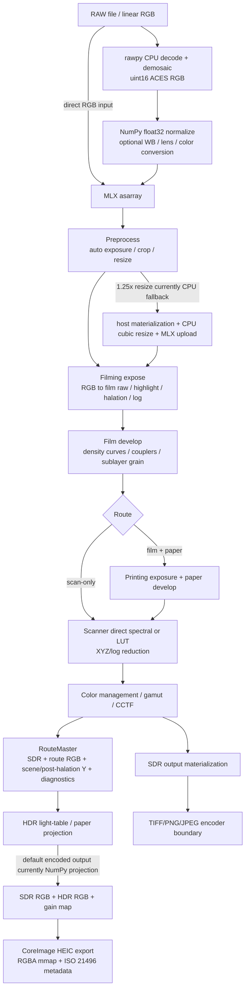

# MLX Performance Reaudit — 2026-07-10

## 结论先行

本轮对 `origin/develop@bc9c4972f82712960f5dd27f74d705a52ca6f799` 的 50MP / 16GiB 验收结论是 **FAIL**。

- 8160 × 6120 的确定性线性 RGB 输入是直接生成的 49,939,200 像素 float32 图像，不是低分辨率放大。最轻的 `scan-only` 已在约 9.0GiB 进程树 RSS、11.0GiB 并发 physical footprint 时触发 10.5GiB 安全保护，未完成输出；后续更重的 50MP 路径因此明确记为 `not-run-safety-abort`，没有伪装成通过。
- 仓库唯一真实 RAW 是 4032 × 3024 DNG。rawpy 解码实测 0.579s；50MP RAW mosaic、decoder RGB 与 Spektrafilm float32 输入的保守重叠为 998,784,000 bytes，但这不是 50MP RAW 实机通过声明。
- 找到并实施了一个达到生产门槛的无损优化：grain caller 仅在实际 `float32` particle-count 下界与 uniformity 范围能静态证明所有 `lambda > 10` 时传入 fast-path hint，MLX Poisson 随后直接返回旧实现本来就会选择的同一 normal 样本，不再构建 60 轮未使用的 Knuth 图。最终 commit 内置的 current-vs-legacy AB/BA 显示，1.5MP simulation-to-array 热时间缩短 55.1–55.2%，sampled physical footprint 降低 42.1–45.0%；film、HDR light-table、HDR paper 与最终 HEIC 的输出 SHA-256 完全一致。128 × 8160 的 50MP 像素尺寸 mixed-lambda 场景仍缩短 16.1–18.5%，footprint 降低 12.3–27.9%，而未命中 hint 的调用保持旧 graph、没有新增 device reduction/host sync。12MP full-effects 从内存保护失败变为成功完成。
- 这个 grain 优化不影响 `scan-only`，因此没有掩盖整体 50MP FAIL。当前首要架构问题仍是 spectral/route 阶段的活跃对象与 MLX allocator cache 生命周期，以及明显低估实际峰值的 memory budget estimator。

机器可读结果见 [`mlx-performance-reaudit-20260710.json`](mlx-performance-reaudit-20260710.json)。

## 基线与环境

| 项目 | 值 |
| --- | --- |
| 基线 | `origin/develop` / `bc9c4972f82712960f5dd27f74d705a52ca6f799` |
| 审查分支 | `codex/mlx-performance-reaudit-20260710` |
| 硬件 | Apple M1 Pro, arm64, 16GiB unified memory |
| 系统 | macOS 26.5.1, build 25F80 |
| Python | 3.13.1 |
| MLX / NumPy | 0.31.2 / 2.4.4 |
| rawpy / psutil / pytest | 0.26.1 / 7.2.2 / 9.0.3 |
| 后端/精度 | MLX Metal GPU；float32；balanced color precision；未启用降低质量参数 |
| 测量工具 | MLX active/peak/cache、psutil process-tree RSS、`/usr/bin/footprint`、`memory_pressure -Q`、`vm.swapusage` |

审查开始时已核对分支、HEAD、remotes、原工作区未提交内容、RAW 样本与最近 MLX/residency/precision/tiling/HDR/ACES/OCIO 提交。原 `develop` 工作区的用户改动始终未被写入或覆盖；所有工作在独立 worktree 完成。

## 当前端到端 MLX 执行图



关键执行语义：

1. MLX 是 lazy graph；本轮计时只在目标输出 `eval` 并 `synchronize`、最终 host/encoder 边界完成后停止。
2. direct spectral Metal kernels已经融合 spectral reconstruction、illuminant 与 XYZ/log reduction，避免两张完整 `H × W × 81` spectral 帧；当前失败仍包含多张 RGB/density/Y 活跃对象和大量 allocator cache。
3. 默认 HDR 输出启用 CCTF encoding，导致 `_sdr_rgb_backend` 不适用并转到 NumPy projection。因而 backend percentile 候选只能作为微基准，不能声称默认端到端收益。
4. preview 使用缩放输入且关闭部分效果，不能复用为 final render；cached RouteMaster Save 已避免重跑完整 simulation。

## 文件覆盖清单

覆盖 manifest 共分配 100 个生产文件；其中 `src/spektrafilm/gpu/`、`runtime/`、`hdr/` 下全部 44 个 Python 文件经脚本验证为“出现一次且仅一次”：`missing=[]`、`duplicated={}`。

| 所有者 | 核心目录文件数 | 额外边界 | 重点 |
| --- | ---: | --- | --- |
| Agent 1 | 18 | RAW、preview、GUI、save、HDR export、I/O | 生命周期、host materialization、RSS/footprint |
| Agent 2 | 20 | ACES、color management、profiles、film/paper/scan stages | spectral/color/HDR、precision、LUT/cache |
| Agent 3 | 6 | diffusion、grain、FFT、Numba/CPU spatial helpers | tiling、FFT、Metal、RNG |
| Controller / Agent 4 seat | benchmark 与验证文件 | artifacts、GPU/HDR/color/RAW/parity tests | lazy timing、统计污染、对抗性验证 |

<details>
<summary>核心 44 个生产文件的唯一归属</summary>

- Agent 1：`gpu/{__init__,backend,cupy_backend,halide_backend,mlx_backend,numpy_backend,residency}.py`；`runtime/{__init__,api,params_builder,params_schema,pipeline,process,route_master,topology}.py`；`runtime/services/{__init__,resize}.py`；`hdr/routemaster_export.py`。
- Agent 2：`gpu/kernels/{color,density,gamut_compress,lut}.py`；`gpu/precision_policy.py`；`hdr/{__init__,ideal_paper,light_table,profile_cache,projection,reference_white,standards,transfer}.py`；`runtime/services/{color_reference,filter_enlarger_source,spectral_lut_compute}.py`；`runtime/stages/{__init__,filming,printing,scanning}.py`。
- Agent 3：`gpu/kernels/{__init__,filters,fused_ops,grain,tile_utils}.py`；`gpu/metal_serialization.py`。

</details>

额外完整覆盖包括 `raw_file_processor.py`、`aces_compat.py`、`color_management.py`、GUI controller/runtime/macos bridge、`hdr_photo.py`、`io.py`、gain-map/ISO 21496、model grain/diffusion/develop、profiles 与相关 benchmarks/tests。直接调用者/被调用者只用于局部追踪，没有转移或重复归属。

## Benchmark 方法与保护

- 每个场景在独立子进程中执行；父进程采样整个进程树。工具保存 cold、hot median/min/max、MLX allocator counters、RSS、physical footprint、swap、pressure、materialization 事件、输出摘要与退出状态。
- physical footprint 主值是同一时刻进程树 current footprint 的采样最大值。各进程历史 peak 之和只保存为保守上界，不参与 PASS/FAIL；MLX active/cache/peak、RSS 与 footprint 从不相加。
- 默认安全保护为 10.5GiB，低于 12GiB PASS 上限。达到保护线、critical pressure、OOM/system kill 或连续 swap 增长时终止子进程并停止矩阵。中断父进程也会终止其子进程。
- 单次 swap 跳升与连续增长分开：前者记录 `short_swap`，至少两个连续的显著增长区间才记为 sustained thrashing。
- `/usr/bin/footprint` 采样成本使 current footprint 的有效间隔约为 1 秒，短峰可能漏采；因此同时保存 process-reported historical peak upper bound。swap 的“连续”判定要求相邻增长区间，增长—平台—再增长会保守记为 short swap。这些限制不影响 50MP FAIL，因为该路径还独立触发 memory guard。
- benchmark 不在 timed phase 前后清空 cache 来美化结果。额外的 tile cache-release prototype 自身计入时间，并因没有内存收益且显著变慢而被拒绝。
- 候选比较使用相同 HEAD、输入、seed、参数；对顺序敏感的候选执行 AB/BA。输出比较使用最终数组 SHA-256；HDR export 比较最终 HEIC SHA-256。
- P0 百分比的计时口径是预生成线性 RGB 后的 `simulation-to-array` 或 `simulation-to-HEIC`，不包含 input generation 或 RAW decode。子进程 wall、input generation 与真实 12.2MP RAW decode 分开保存；由于没有 50MP RAW，本报告不声称 P0 的 RAW end-to-end 百分比。

## 主要实测结果

### 50MP / 16GiB

| 路径 | 状态 | concurrent footprint | process-tree RSS | pressure / swap | 说明 |
| --- | --- | ---: | ---: | --- | --- |
| scan-only | `memory-guard` | 11.0GiB | 8.96GiB | 最低 free 25%；swap +0.89GiB | 未完成输出；无 fallback |
| film + paper | `not-run-safety-abort` | — | — | — | scan-only 共同前缀已失败 |
| film + paper + spatial/grain | `not-run-safety-abort` | — | — | — | 12MP 同路径已到 11.0GiB |
| HDR light-table | `not-run-safety-abort` | — | — | — | 12MP 同路径已到 11.0GiB |
| HDR paper | `not-run-safety-abort` | — | — | — | 比 light-table 更重 |
| preprocess resize 1.25x | `not-run-safety-abort` | — | — | — | 输出升至约 78MP；12MP 已需 6.76GiB |
| save boundary | `not-run-safety-abort` | — | — | — | scan prefix 加整数/encoder buffer |
| HDR export boundary | `not-run-safety-abort` | — | — | — | scan prefix 加 SDR/HDR/gain-map/RGBA mmap |

现有 estimator 对 50MP 各非 resize 路径都报告 7429.6MiB；实际 scan-only 在尚未输出时已越过 10.5GiB 并采到 11.0GiB，因此当前 estimator 不能作为 16GiB 默认安全门。

### 12MP 路径基线

| 路径 | cold | hot median | footprint | MLX peak | MLX cache | 结论 |
| --- | ---: | ---: | ---: | ---: | ---: | --- |
| scan-only | 2.353s | 1.863s | 4.31GiB | 1.37GiB | 2.29GiB | 完成、hash 稳定 |
| film + paper | 2.628s | 2.272s | 4.35GiB | 1.37GiB | 2.33GiB | 完成、hash 稳定 |
| preprocess resize 1.25x | 23.254s | 22.676s | 6.76GiB | 1.93GiB | 3.65GiB | CPU resize boundary 是主要时间 |
| save boundary | 4.171s | 2.658s | 4.36GiB | 1.37GiB | 2.33GiB | 完成 TIFF 边界 |
| full spatial/grain，旧基线 | — | — | 11.0GiB | 未完成 | 未完成 | memory guard；swap +1.93GiB |
| HDR light-table，旧基线 | — | — | 11.0GiB | 未完成 | 未完成 | memory guard；swap +2.48GiB |

### P0 grain fast path

生产改动位于 `src/spektrafilm/model/grain.py:143-162` 与 `src/spektrafilm/gpu/kernels/grain.py:150-229`。grain caller 只有在以下静态条件同时成立时才传入 hint：particle count 是 scalar，转换成实际 MLX 使用的 `float32` 后仍严格 `> 10`；uniformity 是 scalar 且位于 `[0, 1]`。由于 probability 已 clip 到 `(0, 1)`，此时 `saturation` 必定在 `(0, 1]`，所以 `lambda = n_particles / saturation > 10` 对每个像素成立。MLX sampler 随后提前返回已经存在的 `normal_clamped`；`key_norm`、normal RNG、round、clamp、阈值与 dtype 均未改变。边界测试明确覆盖 Python `10.0000001` 舍入成 float32 `10.0` 时不得传 hint，以及 `nextafter(float32(10), +inf)` 时可以安全传 hint。

未命中 hint 的 all-low、mixed、NaN、negative、empty 与 `+inf` 调用保留审查前的完整 graph；没有 `mx.all`、host scalar readback 或额外 device sync。CPU 与 CuPy 路径不使用该 hint。benchmark 内置 `legacy-poisson` reference，复制 `bc9c497...` 的旧 merge，因此最终 commit 本身可直接重现差值，而不依赖旧 worktree。

| 1.5MP film+paper+spatial/grain | legacy hot | current hot | 时间变化 | legacy footprint | current footprint | 输出 |
| --- | ---: | ---: | ---: | ---: | ---: | --- |
| AB | 1.195s | 0.537s | -55.1% | 3.04GiB | 1.67GiB | exact SHA-256 |
| BA | 1.210s | 0.542s | -55.2% | 2.92GiB | 1.69GiB | exact SHA-256 |

Cold 的 legacy→current 分别为 AB 1.853→1.149s、BA 1.982→0.919s。每次完整 render 的 9 个 Poisson 调用都能由 1.5MP particle lower bound 静态证明为 normal-only。四个最终子进程均为 normal pressure 且 swap growth 为 0。

为覆盖 50MP 像素尺寸下部分 layer 的 `n_particles <= 10`，另用 128 × 8160（约 1MP、与 50MP 同最大边长/同 pixel size 推导）的宽图运行完整 film+paper+spatial/grain：

| mixed-lambda simulation-to-array | legacy hot | current hot | 时间变化 | footprint 变化 | 输出 |
| --- | ---: | ---: | ---: | ---: | --- |
| AB | 0.881s | 0.739s | -16.1% | -27.9% | exact SHA-256 |
| BA | 0.924s | 0.752s | -18.5% | -12.3% | exact SHA-256 |

这一路只有可静态证明的 layer 使用 fast path；其余 layer 完整执行 legacy merge。focused test 还将 unhinted mixed 的 `mx.all` 替换为失败函数，证明生产路径没有新增 scalar sync。

| 1.5MP HDR 路径 | legacy hot | current hot | 时间变化 | footprint 变化 | 等效性 |
| --- | ---: | ---: | ---: | ---: | --- |
| light-table | 1.788s | 1.226s | -31.4% | -40.3% | SDR/HDR/gain-map exact hashes |
| paper | 1.565s | 1.019s | -34.9% | -39.2% | SDR/HDR/gain-map exact hashes |
| final HEIC export | 2.559s | 2.057s | -19.6% | -36.9% | exact HEIC hash |

当前生产实现复现所有 prototype hashes。最终 12MP full-effects 运行成功：cold 5.941s、hot 5.534s、sampled concurrent footprint 7.93GiB、process-reported peak upper bound 8.62GiB、MLX peak 3.82GiB、hot MLX cache 6.57GiB、最低 free 26%。该次出现一次 1.24GiB swap 跳升后保持平坦，记为 short swap 而非 sustained thrashing，因此该单路径运行是 CONDITIONAL；另一次等价运行没有 swap 增长。由于 50MP scan-only 在 grain 关闭的配置中就失败，此局部 P0 不改变总体 FAIL，也不被描述为 50MP 或 RAW end-to-end 通过。

### 其他 prototypes 与微基准

| 候选 | 类型 | 实测 | 等效性 | 裁决 |
| --- | --- | --- | --- | --- |
| stable compile key | 1.5MP simulation-to-array AB/BA | 合并热样本：scan -17.5%、full -1.3%、HDR light -3.4%、paper -0.5%；scan 基线因运行顺序呈明显双峰 | exact hashes | `needs-evidence`；不能把 persistent cache 热度当收益 |
| exact partition percentile | 12,192,768 元素 micro | two-partition 0.06545s vs sort 0.03562s，慢 83.75% | exact scalar | `not-worthwhile` |
| fused filming tiling | 6MP kernel micro | 慢 5.4%，MLX peak 未降 | max diff 3.69549e-6；211,850 值超过 1e-6 | `unsafe` |
| tile cache release | 12MP simulation-to-array | footprint/cache 不降；scan 慢 32.5%，film+paper 慢 14.1% | exact hashes | `not-worthwhile` |
| native MLX cubic resize | local prototype | 调整输出 shape 后仍有约 0.18–1.0 max diff | 不符合 CPU cubic contract | `unsafe` |
| tile concat assembly | 历史 micro | 12MP +8.39%、24MP +7.97%，低于 10% gate | 已有 parity | `already-addressed` |

## 峰值时同时存活的主要对象

以下是生命周期对象，不与 allocator/RSS 简单相加：

| 对象 | 50MP 大小 | 生命周期/峰值作用 |
| --- | ---: | --- |
| NumPy linear RGB 输入 | 571.5MiB | synthetic input 或 rawpy normalization 后持续到 pipeline 返回 |
| MLX RGB upload / 单张 RGB、log RGB、density RGB | 每张 571.5MiB | 多个 stage 交接时可能同时存在；lazy graph 延长引用 |
| 单张 Y / gain-map | 190.5MiB | scene Y、post-halation Y、HDR luminance/gain-map sidecars |
| 3×3 sublayer density | 1.67GiB | full grain 路径；旧 Poisson 又为每层构建 normal 与 60 轮 Knuth 图 |
| 默认 765-row、81-sample spectral tile 的理论 float32 张量 | 1.88GiB | direct fused kernels避免完整 spectral 双帧，但 tile/临时 allocation 仍影响 allocator cache |
| 12MP scan 后 MLX cache | 实测 2.29GiB | active 仅约 140MiB 时 cache 仍很大；50MP scan 的主要 residency 风险之一 |
| HDR SDR + HDR RGB | 合计 1.12GiB | projection 到 HEIC encode 期间并存 |
| HDR gain map / luminance | 每张 190.5MiB | RouteMaster、projection result 与 sidecar |
| 两个 RGBA float32 mmap payload | 合计 1.49GiB | CoreImage encoder 输入；另有 clipped SDR/HDR 工作集 |
| RAW mosaic + decoder RGB + pipeline input | 保守 952.5MiB | rawpy 属外部 decode/demosaic；Spektrafilm 仍控制 postprocess/WB/lens/color 生命周期 |

50MP scan-only 子进程在保护终止前无法写出内部 MLX counters，因此不能把某一张数组伪称为唯一峰值。12MP 的 active/cache/footprint 对照与代码生命周期共同指向：多张 full-frame stage 对象、lazy output assembly 和跨 tile/stage 保留的 allocator cache 是同时存活集合；当前预算模型只按 RGB 倍数估算，未校准这些实测 cache 与 route sidecars。

## 合并后的有效发现

| ID | 代码位置 | 当前成本 | 优化假设 | 收益证据 | 内存影响 | 等效性风险 | 验证方法 | 结论 |
| --- | --- | --- | --- | --- | --- | --- | --- | --- |
| F01 | `model/grain.py:143-154`; `gpu/kernels/grain.py:150-229` | 可静态证明 normal-only 时仍构建 60 轮 Knuth | caller-proven hint 直接返回原 normal branch；未 hint 保持旧 graph | final-tree current/legacy AB/BA、mixed-width、HDR、HEIC、12MP | high decrease | low；已 golden-byte | seed、threshold/mixed/NaN/empty、simulation/HEIC hash、全套测试 | `measured-win` |
| F02 | `runtime/pipeline.py:695-815`; `kernels/tile_utils.py`; scan/print stages | 50MP estimator 7.26GiB，实际 scan 未输出已 11GiB | 用实测 route/stage/cache 模型做默认 preflight；逐 stage 释放死对象并验证 adaptive spectral tile | 50MP/12MP guard 实证 | high decrease estimate | low-medium | 50MP scan 冷/热、active/cache/footprint 时间线、exact hash | `promising` |
| F03 | `utils/raw_file_processor.py:45-74` | custom/tungsten WB 连续 full-frame float64 RGB/XYZ 帧 | 同一 colour 调用按行块写 float32 输出 | dtype/lifecycle 静态确认 | high decrease estimate | low | 真实 RAW 全 WB 逐元素比较，12/50MP footprint | `promising` |
| F04 | `utils/hdr_photo.py:547-622`; RouteMaster export | clipped SDR/HDR 与 RGBA mmap 长时间并存 | 分块 clip 写 mmap，尽早释放未消费 projection arrays | 50MP 明确约 1.12GiB RGB pair + 1.49GiB mmap | high decrease estimate | low-medium | raw payload、HEIC、ISO 21496、sidecar byte parity | `promising` |
| F05 | `runtime/pipeline.py`; GUI controller | legacy `hdr_scene_energy` 与两次全输入 hash 增加 host 工作 | 延迟 sidecar；按 input generation 缓存 fingerprint | 调用链静态确认 | medium/high estimate | medium | load/rotate/state invalidation；cached Save 不触发 | `promising` |
| F06 | `hdr/ideal_paper.py`; `hdr/projection.py` | 多数 safe chemical profile 强制 full NumPy；projection 结果保留未消费 Y/gain | backend 插值及 export-specific result contract | 128/160 safe profiles；50MP 可少约 400MiB result | high decrease estimate | medium | ramp/endpoint/NaN、projection/export hashes | `promising` |
| F07 | `gpu/mlx_backend.py`; color/density kernels | 局部 closure `id` 使 compile cache miss/清表 | 稳定 code/closure/shape key | cache growth复现；E2E收益小且顺序敏感 | low/medium estimate | medium | 200帧、多 shape/closure 值、AB/BA | `needs-evidence` |
| F08 | gamut/color kernels | 多次 RGB↔XYZ/OkLab 与常量上传 | 有界常驻常量及严格同序 fusion | 仅静态/micro 证据 | medium estimate | high | color precision budget、极值/NaN、12MP E2E | `needs-evidence` |
| F09 | HDR percentile | 两次 full sort | 两次 partition selection | 实测慢 83.75%；默认路径未调用 | 无收益 | low | 已显式 eval/sync micro | `not-worthwhile` |
| F10 | fused filming tiling | full FFT 峰值假设 | 接已有 tiled wrapper | 6MP 不降峰且变慢 | none measured | high；超 1e-6 | impulse/random/border/E2E | `unsafe` |
| F11 | tile cache release | tile hook当前 no-op | 每 tile `mx.clear_cache` | exact，但无内存收益且慢 14–33% | none measured | low | 12MP AB | `not-worthwhile` |
| F12 | precision fallbacks | balanced Mitchell、strict spectral/Jz host成本 | 取消 fallback | 会破坏既有 precision contract | 可能降低内存 | high | CPU float64 / budget tests | `unsafe` |
| F13 | direct spectral fusion | 原先两张 full spectral 中间量 | Metal direct reduction | 当前已实现并覆盖测试 | already saved | 已验证 | density/spectral parity | `already-addressed` |
| F14 | tile assembly scatter | immutable `.at.add` | concat / in-place Metal scatter | concat低于 gate；当前 API 无合格原地方案 | 已测 | high | 仅 API 条件改变后重开 | `already-addressed` |

## 优先级与最值得实施的三个优化

| 级别 | 候选 | 状态 |
| --- | --- | --- |
| P0 | F01 caller-proven all-normal Poisson early return | 已实施；高置信、低风险、simulation/encoder 与内存 measured win |
| P1 | F02 以真实 route/cache 校准 50MP estimator，并定位 stage-aware release/adaptive tile | 下一轮必须先做；这是 scan-only 50MP 的阻塞项 |
| P1 | F03 RAW WB row-chunk | 无真实 50MP RAW，需局部 prototype 后才能生产化 |
| P1 | F04 HDR pair/mmap streaming | 代码生命周期明确，需 HEIC/ISO 21496 byte-parity prototype |
| P1 | F05 legacy HDR sidecar/hash 延迟 | 需要 GUI invalidation 与公开 metadata contract 测试 |
| P2 | F06 safe chemical backend / export-specific projection result | 中等语义风险，先小型 prototype |
| P2 | F07 stable compile key；F08 color/gamut fusion | 收益不稳定或 precision 风险高 |
| Reject | partition percentile、当前 fused tiling、per-tile cache clear、native resize、取消 precision fallback、重开 scatter | 已实测无益或不等效 |

当前最值得继续实施的三个优化：

1. **已完成的 grain all-normal fast path**：唯一达到 P0 的本轮生产改动。
2. **50MP scan 的 stage/cache-aware residency 修复**：先用 active/cache/footprint 时间线找出峰值 stage，修正 estimator，再只对已死对象/真实 tile 工作集做无损释放或自适应；这是从 FAIL 走向可完成的必要条件。
3. **RAW custom/tungsten white-balance row chunking**：保持相同 colour-science 调用与 float64 计算，只缩短 full-frame float64 临时量生命周期；需真实 RAW 多 WB 逐元素 gate。

HDR encoder streaming 排第四，因为它只能降低最终 HDR export 峰值，不能修复更早的 scan-only 失败。

## 已否定或不值得实施的方案

- 当前 fused filming tiling 同时更慢且超出 `1e-6` contract，不能用内存换取细微输出变化。
- `mx.partition` 在需要线性插值的 99.9 percentile 上要做两次 partition，比一次 sort 明显更慢。
- 逐 tile cache clear 没有降低 12MP footprint/cache，却显著降低吞吐；也不能用它清掉计时之外的 cache 来美化峰值。
- MLX cubic resize 与现有 CPU cubic 的 shape/边界/像素不等效。
- concat tile assembly 未达到既定 10% gate；原地 Metal scatter 在当前 API/实现条件下仍没有新证据。
- 不取消 balanced/strict precision fallback，不使用 float16，不减少 spectral/LUT/kernel/grain/gain-map 质量，不改变随机分布。

## 命令与结果文件

主要原始结果：

- `/tmp/spektrafilm-mlx-audit/50mp-scan-guarded.json`
- `/tmp/spektrafilm-mlx-audit/12mp-route-isolation.json`
- `/tmp/spektrafilm-mlx-audit/12mp-spatial-guarded.json`
- `/tmp/spektrafilm-mlx-audit/12mp-hdr-light-guarded.json`
- `/tmp/spektrafilm-mlx-audit/final-v2-all-normal-{ab,ba}.json`
- `/tmp/spektrafilm-mlx-audit/final-v2-mixed-{ab,ba}.json`
- `/tmp/spektrafilm-mlx-audit/final-repro-hdr-current-vs-legacy.json`
- `/tmp/spektrafilm-mlx-audit/final-production-poisson-12mp.json`
- `/tmp/spektrafilm-mlx-audit/tile-cache-12mp-ab.json`

核心命令均保存在机器结果的 `commands` 字段。代表性命令：

```bash
.venv/bin/python benchmarks/benchmark_mlx_performance_reaudit.py \
  --scenarios scan-only --height 6120 --width 8160 --hot-runs 0 \
  --sample-interval 0.2 --max-footprint-gib 10.5 \
  --output-json /tmp/spektrafilm-mlx-audit/50mp-scan-guarded.json

.venv/bin/python benchmarks/benchmark_mlx_performance_reaudit.py \
  --scenarios film-paper-spatial-grain \
  --candidates baseline legacy-poisson \
  --height 1024 --width 1536 --hot-runs 5 --max-footprint-gib 10.5 \
  --output-json /tmp/spektrafilm-mlx-audit/final-v2-all-normal-ab.json
```

## 验证

定向验证：

- `tests/test_mlx_performance_reaudit_benchmark.py`: 24 passed
- `tests/test_grain.py`: 27 passed
- tile assembly / resize residency / spatial tiling / GPU pipeline / HDR projection：46 passed, 2 skipped
- 定向合计：97 passed, 2 skipped

完整非 GUI suite：`1688 passed, 20 skipped, 4 xfailed`，77.50s。六条 warning 均来自既有 small-image autoexposure、colour CAM16/HLG 边界，没有新增失败。该 pytest 进程由 `/usr/bin/time -l` 记录 maximum RSS 1,265,762,304 bytes、peak physical footprint 4,667,934,568 bytes、swaps 0。`git diff --check` 已通过；GUI tests 按仓库规范未纳入 headless suite。

## 对抗性复核

- **是否遗漏 MLX 生产路径？** 核心 44 文件唯一覆盖验证通过；RAW、ACES/color、GUI、save/export 与直接边界另行覆盖。
- **是否把 lazy graph build 当执行时间？** 否；每次计时都在输出 eval/synchronize 与最终 materialize/encoder 后结束。
- **RAW decode/export 是否遗漏？** 12.2MP rawpy decode 单独实测；50MP decoder overlap 保守列出；1.5MP HDR HEIC 是真实编码并比对最终文件 hash。没有把 synthetic pipeline 称作真实 RAW E2E。
- **内存 counters 是否重复相加？** 否；active/cache/peak、RSS、physical footprint 分栏报告。
- **是否通过 cache 清理隐藏峰值？** 否；唯一 cache-release prototype 在 timed path 内且被 Reject。
- **是否改变效果、随机分布或 precision？** P0 使用旧 normal key/算术/阈值；hint 由 scalar lower-bound 数学证明，未 hint 的 mixed/NaN/empty 保留旧 graph且没有新增 sync；golden bytes、film/HDR/HEIC hashes与完整 suite 均通过。
- **结论是否只在 synthetic micro 成立？** P0 有完整 film/HDR simulation 和实际 HEIC export-boundary 证据；50MP 结论则诚实标记 synthetic direct RGB 和真实 RAW 缺口。
- **50MP 是否真正在 16GiB 完成？** 否，最轻路径失败，所以结论是 FAIL。
- **所有 P0 是否可复现？** 是；生产代码、golden tests、AB/BA benchmark 与机器 JSON 都在本提交范围。

独立只读复审迭代检查了实现与报告。首轮提出 mixed 路径的动态 scalar sync、最终 commit 无法重现旧 baseline、以及把不含 RAW/input 的计时称为端到端；后续复审又发现 Python `10.0000001` 会量化成 float32 `10.0` 的阈值漏洞，以及报告摘要/验证数字陈旧。最终实现逐项修正：fast-path hint 改为 caller 对实际 float32 下界的静态证明，未 hint 路径不做 reduction；benchmark 内置逐元素等效的 `legacy-poisson` reference；报告与 JSON 统一使用 simulation-to-array / simulation-to-HEIC，并单列 RAW decode/input generation；阈值、摘要和 fresh suite 结果均有回归覆盖。R4 最终结论为 `CLEAR`，没有遗留 Critical / Important。

## 实际代理配置

用户请求的角色标签是 GPT-5.6 Sol 总控与 GPT-5.6 Luna workers。当前运行时没有可检查的具体模型身份，也没有对子代理指定模型的 API，因此没有声称启用了不可验证的 Sol/Luna 模型。实际主审结构是总控加三个 model-opaque 子代理并行审查；四并发槽位中的第四个验证席由总控承担。另使用一个 model-opaque 只读复审代理做迭代对抗性检查。总控负责 goal、计划、覆盖分配、benchmark、冲突裁决、P0 验收、报告与最终提交。
