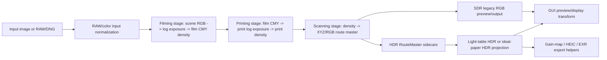

# Adversarial Full-Repository Review - Spektrafilm 2026-06-08

Review target: `/Users/retriedstormtrooper/Documents/Projects/Active/spektrafilm-main`

This is a review-only artifact. No source, test, configuration, baseline, or existing documentation file was intentionally modified by this review pass outside `docs/reviews/`.

## Executive Summary

The current workspace is a fast-moving dirty tree on `develop`, not a clean `HEAD` review. The review covers the current local state, including tracked modifications and relevant untracked files. That matters: the initial planning snapshot had 36 modified tracked files and 25 untracked files, while the final status snapshot had 52 modified tracked files and 233 untracked entries. Findings below may therefore apply to uncommitted local work rather than committed repository history.

I found 14 evidence-backed findings:

| Severity | Count |
| --- | ---: |
| Critical | 0 |
| High | 4 |
| Medium | 6 |
| Low | 3 |
| Nit | 1 |

The highest-risk theme is semantic drift between user-visible HDR/GPU controls and the computation that actually runs. The most severe concrete risks are:

1. MLX grain does not meet the repository's CPU parity contract.
2. MLX `soft_update()` can keep stale backend print-illuminant tables after enlarger filter changes.
3. RouteMaster paper HDR currently ignores print density curve morph in the failing full-suite test.
4. `output_diffuse_white` is accepted and validated but does not affect HDR projection output.
5. HEIC metadata is passed through the export stack and then discarded, while GUI metadata copy is a no-op for HEIC.

The final full non-GUI pytest run failed one HDR paper-route regression:

```text
1 failed, 1480 passed, 7 skipped, 4 warnings in 79.55s
FAILED tests/test_hdr_routemaster_projection.py::test_paper_mode_responds_to_print_density_curve_morph
```

Earlier targeted HDR, GPU, Halide, LUT/runtime/raw/profile, GUI, Swift, and import smoke validations passed. Android `./gradlew test` did not complete locally and was killed after more than six minutes without useful output, so Android validation remains inconclusive.

## Repository State

Planning-time baseline recorded in `adversarial_full_repo_review_plan_20260608.md`:

- Branch: `develop`
- HEAD: `48655e1 feat: implement MLX backend-resident float32 P1 foundation and initiate HDR routemaster rewrite`
- Branch relation: `develop...origin/develop [ahead 3]`
- Remotes: `origin` and `upstream`
- Dirty state at planning: 36 modified tracked files, 25 untracked files
- Tracked files at planning: 1247
- Non-excluded filesystem files at planning: about 1312
- Test collection at planning: 1435 tests

Final state checked before report writing:

- Branch: `develop...origin/develop [ahead 3]`
- HEAD: `48655e1 (HEAD -> develop) feat: implement MLX backend-resident float32 P1 foundation and initiate HDR routemaster rewrite`
- Remotes:
  - `origin https://github.com/21Z121Z1/spektrafilm.git`
  - `upstream https://github.com/andreavolpato/spektrafilm.git`
- Tracked files: 1247
- Git untracked entries: 233
- Modified tracked status lines: 52
- Non-excluded filesystem files: 1500
- Excluded generated/env/cache files: 45620
- Code files counted with `.py`, `.pyi`, `.c`, `.cpp`, `.h`, `.hpp`, `.kt`, `.kts`, `.swift`, `.sh`, `.command`, `.bat`, `.js`: 374 files, 95758 LOC
- Tracked code files: 363 files, 92136 LOC
- Structured/text-ish files counted: 1325
- Most common extensions: `.md` 437, `.py` 304, `.json` 243, `.icc` 173, `.png` 135, `.csv` 72

Credibility impact: the file count changed materially during the review because untracked analysis artifacts appeared under `analysis/metal_float32_precision/` and additional source/tests appeared under `src/`, `tests/`, `tools/`, `docs/plans/`, and `docs/reports/`. The report treats the final dirty workspace as the target but cannot claim stable clean-commit reproducibility.

## Review Scope and Exclusions

Included line-by-line or call-chain review:

- Runtime API, params, topology, simulation pipeline, film/print/scan stages, profile loading.
- HDR RouteMaster, light-table/paper projection, HDR HEIC export, gain-map metadata and I/O, EXR/HEIC utility boundaries.
- GPU backends and kernels: NumPy, MLX, CuPy, Halide, residency tracking, benchmark tools, parity tests.
- GUI controller/state/persistence/display/output wiring, including HDR export state and display transform.
- LUT creator package, color-space registry, OCIO/bundle formats, LUT tests.
- Android Kotlin/C++/JNI/Halide AOT surface and Gradle configuration.
- macOS Swift package and Python bridge.
- Tests, docs, scripts, tools, project configuration, dependency metadata, and absence of CI workflow.

Reviewed as inventory and contract data rather than line-by-line algorithm source:

- ICC binary profiles under `src/spektrafilm/data/icc/**`.
- HDR curve-profile sample JSON corpus under `src/spektrafilm/data/hdr_curve_profiles/samples/**`.
- Static Android AOT `.a` files under `android/app/src/main/cpp/halide-aot/**`.
- Generated benchmark/report/image artifacts under `docs/dev/benchmark-artifacts/**`, `analysis/metal_float32_precision/results/**`, and image/result corpora.
- `.npz` golden baselines under `tests/baselines/**`.

Excluded from line-by-line review with reason:

| Path or pattern | Reason |
| --- | --- |
| `.git/` | Git object/index internals. |
| `.venv/` | Local dependency environment, not project source. |
| `__pycache__/`, nested `__pycache__/` | Python bytecode cache. |
| `.pytest_cache/`, `.mypy_cache/`, `.ruff_cache/`, `.tox/`, `.nox/` | Tool caches. |
| `.gradle/`, `android/.gradle/`, `android/app/build/` | Gradle cache/build output. |
| `macos/SpektrafilmMac/.build/` | SwiftPM build output. |
| `.DS_Store` | macOS metadata. |
| `*.a`, `gradle-wrapper.jar` | Platform/vendor binary artifacts; reviewed only as inventory and supply-chain/platform risk. |
| `*.icc`, large `*.png`, generated `*.csv`/`*.json` benchmark outputs | Data/binary/generated artifacts; reviewed for presence, provenance, and contract impact, not source logic. |

## Architecture Map

The documented package split is still the right top-level mental model:

- `src/spektrafilm`: reference runtime and data contracts. It should not depend on GUI or LUT creator.
- `src/spektrafilm_gui`: Qt/napari desktop application, controller/state/output orchestration.
- `src/spektrafilm_lut_creator`: LUT bundle builder, QA, OCIO emission, CLI.
- `android/`: Kotlin app, C++ JNI pipeline, Halide AOT artifacts.
- `macos/SpektrafilmMac`: SwiftUI/AppKit shell over the Python bridge.

Primary entry points:

- Runtime API: `src/spektrafilm/runtime/api.py`, exported through `src/spektrafilm/__init__.py`.
- Core pipeline: `src/spektrafilm/runtime/pipeline.py`.
- GUI app: `src/spektrafilm_gui/app.py`.
- GUI output/controller hot paths: `src/spektrafilm_gui/controller.py`, `controller_runtime.py`, `controller_layers.py`.
- LUT CLI/API: `src/spektrafilm_lut_creator/cli.py`, `builders.py`.
- HDR export facade: `src/spektrafilm/hdr/routemaster_export.py`, `src/spektrafilm/utils/hdr_photo.py`.
- Platform bridges: `android/app/src/main/cpp/spektrafilm_android_jni.cpp`, `macos/SpektrafilmMac/Sources/SpektrafilmMacCore/Services/SpektrafilmPythonClient.swift`, `src/spektrafilm_gui/macos_bridge.py`.

High-level data flow:



Subsystem call relationships:

- RAW/DNG input enters through `raw_file_processor.py`, then runtime parameters and `SimulationPipeline`.
- `SimulationPipeline.process()` owns the SDR path. `process_master(..., hdr_mode=...)` builds RouteMaster sidecars for HDR projections.
- `project_hdr_light_table()` should ignore paper controls and use film/scene authority.
- `project_hdr_ideal_paper()` should preserve the legacy SDR print look below diffuse white while extending highlights above white from scene/material energy.
- `save_hdr_photo_heic_from_pair()` writes HEIC gain-map exports through macOS ImageIO/CoreImage helper paths when available.
- GUI export travels through `controller.py` and `utils/io.py`; HEIC is special-cased away from normal metadata writing.
- GPU backends expose a NumPy-like backend API. CPU/NumPy is the numeric reference; MLX is the locally verified Apple GPU path; CuPy is hardware-gated; Halide is experimental/JIT/AOT bounded by tests.

## Critical Invariants

The review used these invariants as attack surfaces:

- SDR preview/output semantics must not change because HDR code exists.
- HDR export must remain explicit/export-only unless a UI/API contract says otherwise.
- CPU/NumPy is the numeric reference.
- GPU results must be float32-close to CPU, not merely visually similar.
- Backend residency boundaries must be explicit; hidden full-frame `to_numpy()` is a performance and contract issue.
- `scene_y_raw`, `post_halation_y`, `route_luminance_y`, `route_look_chroma`, `material_detail_y`, `diffuse_white_scene_anchor`, `output_diffuse_white`, and `headroom` must not be treated as interchangeable units.
- Light-table HDR and paper HDR must not share controls accidentally: light-table should not respond to paper controls, while paper HDR must respond to print/paper controls that define the print route.
- HEIC/Ultra HDR/gain-map metadata success must be proven by readback or explicit unsupported status, not by a function returning success before metadata is written.
- Public-looking tap/injection APIs must either initialize all downstream side effects or reject unsupported injection points.

Conceptual drift found:

- `output_diffuse_white` is a validated output-sounding knob but only a diagnostic in production projection.
- Paper HDR uses `scene_y_raw` authority and can miss a print-render chemistry control now required by tests.
- GUI display transform uses display/profile terminology but collapses to clipped 8-bit SDR before ImageCms conversion.
- HEIC metadata is passed as if supported but then discarded or skipped.

## Top 10 Highest-Risk Findings

| Rank | ID | Severity | Area | Summary |
| ---: | --- | --- | --- | --- |
| 1 | SF-20260608-001 | High | GPU correctness | MLX grain uses normal approximation and violates CPU parity. |
| 2 | SF-20260608-002 | High | GPU/runtime correctness | MLX `soft_update()` can use stale backend print illuminant tables. |
| 3 | SF-20260608-014 | High | HDR/color correctness | Current paper HDR path ignores print density curve morph; final full suite fails. |
| 4 | SF-20260608-003 | High | HDR/color semantics | `output_diffuse_white` is validated but not used for projection output. |
| 5 | SF-20260608-005 | Medium | HDR export metadata | RouteMaster HEIC metadata is passed and then discarded; GUI metadata copy is no-op. |
| 6 | SF-20260608-006 | Medium | Gain-map robustness | Gain-map loaders silently degrade and HEIF metadata extraction is unimplemented. |
| 7 | SF-20260608-007 | Medium | GUI/HDR performance | GUI display transform materializes full frames and quantizes to 8-bit. |
| 8 | SF-20260608-004 | Medium | Runtime API boundary | Mid-pipeline injection can skip preprocess side effects and crash DIR couplers. |
| 9 | SF-20260608-009 | Medium | CI/platform | No GitHub CI workflow exists for multi-platform HDR/GPU/GUI codebase. |
| 10 | SF-20260608-008 | Medium | GPU maintainability/perf | GPU enlarger LUT mode returns direct computation while unreachable LUT code remains. |

## Findings by Severity

Full structured details are in `adversarial_full_repo_findings_20260608.json`.

### High

- `SF-20260608-001`: `src/spektrafilm/model/grain.py::_layer_particle_model_gpu` uses a normal approximation in the MLX branch. Probe result: CPU vs MLX fixed-seed grain max absolute difference was `0.5796337127685547`, `allclose_1e-6=False`.
- `SF-20260608-002`: `src/spektrafilm/runtime/stages/printing.py::_precompute_spectral_tables` caches `_backend_print_illuminant`; `SimulationPipeline.soft_update()` mutates enlarger filters without refreshing it. Probe result: soft-updated vs rebuilt MLX output max absolute difference was `0.5277431011199951`.
- `SF-20260608-003`: `src/spektrafilm/hdr/projection.py::HDRProjectionConfig.output_diffuse_white` is validated and emitted in diagnostics but not used to compute HDR RGB or gain-map output.
- `SF-20260608-014`: `tests/test_hdr_routemaster_projection.py::test_paper_mode_responds_to_print_density_curve_morph` fails in the final full non-GUI run; paper HDR output is unchanged when `print_render.density_curves_morph.gamma_factor=1.3`.

### Medium

- `SF-20260608-004`: `SimulationPipeline._process_topology` can skip preprocess side effects and crash with spatial DIR couplers because `pixel_size_um` stays `None`.
- `SF-20260608-005`: RouteMaster HEIC metadata is passed to `save_hdr_photo_heic_from_pair()` and immediately deleted; GUI metadata copy skips HEIC/HEIF.
- `SF-20260608-006`: `gain_map_io` catches decode failures silently and HEIF load returns `metadata=None`.
- `SF-20260608-007`: GUI display transform converts full-frame arrays to clipped 8-bit before ImageCms profile transform.
- `SF-20260608-008`: GPU enlarger LUT path immediately returns direct spectral computation while unreachable LUT code remains below.
- `SF-20260608-009`: No CI workflow exists beyond `.github/FUNDING.yml`.

### Low

- `SF-20260608-010`: `SimulationWorker.run` catches `BaseException`.
- `SF-20260608-011`: RAW EXIF read catches broad `Exception` and silently disables lens correction context.
- `SF-20260608-012`: `AGENTS.md` describes Linux/no GUI/no macOS while this review ran macOS GUI and Swift validations.

### Nit

- `SF-20260608-013`: `numba_boost_hightlights.py` misspelling coexists with highlight utilities.

## Findings by Subsystem

| Subsystem | Finding IDs | Risk profile |
| --- | --- | --- |
| Runtime/model pipeline | SF-20260608-004 | Public/debug topology injection does not initialize required downstream side effects. |
| Print/runtime GPU | SF-20260608-002, SF-20260608-008 | Backend caches and LUT-mode contracts are not sufficiently explicit. |
| Grain/GPU precision | SF-20260608-001 | MLX grain does not satisfy CPU parity. |
| HDR RouteMaster projection | SF-20260608-003, SF-20260608-014 | Output knobs and paper-route controls are semantically inconsistent. |
| HEIC/gain-map I/O | SF-20260608-005, SF-20260608-006 | Metadata success is not proven and partial load success is too quiet. |
| GUI/display | SF-20260608-007, SF-20260608-010 | Preview transform is expensive/8-bit; worker catches fatal exceptions. |
| RAW/DNG | SF-20260608-011 | EXIF failure is not surfaced. |
| Platform/docs/CI | SF-20260608-009, SF-20260608-012 | Current validation relies on local manual runs and docs can mislead agents. |
| Maintainability | SF-20260608-008, SF-20260608-013 | Dead/unreachable branch and misspelled module increase future edit risk. |

## Per-File Review Notes

This section records review receipts by file groups. Files with concrete findings are listed with the finding ID. Files without findings were checked for the failure modes shown in the group notes. Large binary/generated resources were inventoried, not line-reviewed.

### Runtime core and model

| Path | Responsibility and entry points | Key assumptions checked | Result |
| --- | --- | --- | --- |
| `src/spektrafilm/__init__.py` | Public package exports. | Import smoke, API exposure. | No finding. |
| `src/spektrafilm/runtime/api.py` | Public `init_params`, `simulate`, profile-loading facade. | Shape/dtype path into `Simulator`, stable API. | No finding. |
| `src/spektrafilm/runtime/pipeline.py` | Main simulation pipeline, soft update, topology, RouteMaster construction. | SDR vs HDR sidecar split, tap injection, cache invalidation, materialization. | SF-20260608-004, part of SF-20260608-002 and SF-20260608-014. |
| `src/spektrafilm/runtime/simulator.py` and runtime facade files | User-facing process/update orchestration. | Backend serialization, no GUI dependency, update paths. | No independent finding. |
| `src/spektrafilm/runtime/params_schema.py`, `params_builder.py`, `params_digest.py` | Parameter dataclasses/defaults/profile digestion. | Default randomness, GUI mapping, density morph propagation. | Used for SF-20260608-014 evidence; no separate finding. |
| `src/spektrafilm/runtime/topology.py` and topology helpers | Tap graph and collect/inject route. | Injection side effects, shape propagation. | Covered by SF-20260608-004. |
| `src/spektrafilm/runtime/stages/filming.py` | Film exposure/development and postprocess integration. | GPU residency, stochastic/spatial side effects, post-halation sidecar. | No separate finding. |
| `src/spektrafilm/runtime/stages/printing.py` | Enlarger spectral compute and print density development. | Cached backend illuminants, density morph, LUT mode, GPU parity. | SF-20260608-002, SF-20260608-008. |
| `src/spektrafilm/runtime/stages/scanning.py` | Density to XYZ/RGB route master and glare. | Route luminance/chroma source, print vs film scan split. | Evidence for SF-20260608-014; no separate finding. |
| `src/spektrafilm/runtime/services/*.py` | Spectral LUT, color references, caches. | Expensive recomputation, cache keys, profile dependencies. | No additional finding beyond cache/LUT concerns above. |
| `src/spektrafilm/model/*.py` | Core film/print/grain/coupler math. | NaN/Inf, dtype conversion, stochastic parity, coupler pixel-size assumptions. | SF-20260608-001; coupler side effect in SF-20260608-004. |
| `src/spektrafilm/data/**` profile JSON/CSV/ICC/HDR curve data | Runtime profile and color resource contracts. | Packaging, ICC naming, sample corpus inventory. | No current file-specific finding; ICC binaries not line-reviewed. |

Checked failure modes for no-finding runtime files: non-RGB shapes, dtype promotion, hidden CCTF conversion, route-kind mismatch, broad exception swallowing, module dependency inversion, cache invalidation, and stale parameter aliases. No additional High/Critical issue was proven beyond the findings listed.

### HDR, color, and image I/O

| Path | Responsibility and entry points | Key assumptions checked | Result |
| --- | --- | --- | --- |
| `src/spektrafilm/hdr/projection.py` | Shared HDR projection config/result/gain-map builder. | Diffuse white units, headroom, gain-map mode, SDR preservation. | SF-20260608-003 and evidence for SF-20260608-014. |
| `src/spektrafilm/hdr/light_table.py` | Film/scene authority HDR route. | Must not respond to paper controls. | Tests cover this; no finding. |
| `src/spektrafilm/hdr/ideal_paper.py` | Print-scan idealized HDR paper. | Must preserve SDR below white and respond to print controls. | SF-20260608-014. |
| `src/spektrafilm/hdr/routemaster_export.py` | Export RouteMaster HEIC facade. | Metadata propagation, mode selection. | SF-20260608-005. |
| `src/spektrafilm/utils/hdr_photo.py` | HDRPhotoMapping, HEIC pair export, gain-map metadata. | Metadata ownership, headroom, profile-aware knobs. | SF-20260608-005. |
| `src/spektrafilm/utils/gain_map.py`, `gain_map_metadata.py`, `heif_iso21496.py` | Gain-map math and metadata serialization/parsing. | ISO/Ultra HDR field contracts, round-trip metadata. | No independent finding beyond loader issue. |
| `src/spektrafilm/utils/gain_map_io.py` | JPEG/HEIF gain-map load/save. | Partial load behavior, metadata readback, corrupt files. | SF-20260608-006. |
| `src/spektrafilm/utils/io.py` | Generic image save/metadata path and HEIC special-casing. | HEIC metadata copy, EXR/PNG/TIFF/JPEG boundaries. | Part of SF-20260608-005. |
| `src/spektrafilm/utils/raw_file_processor.py` | RAW/DNG processing, EXIF/lens context. | Missing EXIF, corrupt metadata, lens correction fallback. | SF-20260608-011. |
| `src/spektrafilm/color_management.py` | ICC/display/color-space helpers. | Profile lookup, platform fallback. | No separate finding. |
| `src/spektrafilm/data/macos/hdr_heif_encoder.swift` | macOS ImageIO/CoreGraphics HEIC helper. | Platform guard, metadata/gain-map path. | Covered by HEIC metadata risk; Swift package tests passed. |

Checked failure modes: SDR contamination by HDR path, gamma/linear confusion, units for scene vs output diffuse white, negative/film_scan/print_scan route mismatch, corrupt HEIC/JPEG partial success, and metadata readback. The strongest unresolved issues are the two HDR projection semantics findings and HEIC metadata loss.

### GPU, MLX, CuPy, Halide, residency

| Path | Responsibility and entry points | Key assumptions checked | Result |
| --- | --- | --- | --- |
| `src/spektrafilm/gpu/backend.py`, `numpy_backend.py`, `mlx_backend.py`, `cupy_backend.py`, `halide_backend.py` | Backend abstraction and platform implementations. | CPU reference, to_numpy boundaries, dtype behavior. | No standalone finding beyond cache/parity issues. |
| `src/spektrafilm/gpu/residency.py` | Backend residency event tracking. | Detect unallowed full-frame materialization. | No finding; useful validation surface. |
| `src/spektrafilm/gpu/kernels/*.py` | GPU kernels for color, density, filters, grain, LUT, spectral. | Float32 parity, CPU fallback, hidden transfers. | Grain parity issue captured in SF-20260608-001. |
| `src/spektrafilm/model/grain.py` and `src/spektrafilm/gpu/kernels/grain.py` | Stochastic grain model and backend helpers. | Fixed-seed CPU/MLX parity, approximation vs exactness. | SF-20260608-001. |
| `scripts/benchmark_mlx_runtime_hotpath.py`, `tools/benchmark_backend_resident_*.py` | Performance/residency benchmarks. | Benchmarks do not prove full GUI residency unless traced. | No finding; report uses them as validation context. |
| `scripts/build_halide_aot_android.sh`, Halide tests | Halide host/AOT toolchain. | Platform availability and parity tests. | Halide pytest slice passed; Android Gradle hung. |

Checked failure modes: CPU/GPU numeric drift, hidden `to_numpy`, float64 requests on MLX, GPU fallback masked as success, LUT interpolation differences, full-frame temporaries, and benchmark overclaiming. MLX grain and stale cache are the proven High issues.

### GUI

| Path | Responsibility and entry points | Key assumptions checked | Result |
| --- | --- | --- | --- |
| `src/spektrafilm_gui/app.py` | GUI entry point. | Importability, no runtime circular dependency. | GUI tests passed. |
| `src/spektrafilm_gui/controller.py` | Layer, save/export, metadata, route output orchestration. | HEIC export, metadata copy, user-visible success. | SF-20260608-005. |
| `src/spektrafilm_gui/controller_runtime.py` | Simulation worker, display transform, preview prep. | Fatal exception handling, full-frame materialization, 8-bit display transform. | SF-20260608-007, SF-20260608-010. |
| `src/spektrafilm_gui/controller_layers.py` | Layer management and output state. | Shape/alpha assumptions, status propagation. | No independent finding. |
| `src/spektrafilm_gui/state.py`, `state_bridge.py`, `params_mapper.py` | GUI state persistence and params mapping. | HDR group wiring, print chemistry propagation. | No independent finding; involved in HDR control surface. |
| `src/spektrafilm_gui/hdr_settings.py`, `param_manifest.py`, `options.py` | User-visible HDR options and manifests. | Output knob semantics, path-to-white, profile-aware controls. | Conceptual drift captured by SF-20260608-003. |
| `tests/gui/*.py` | GUI regression tests. | Controller output, persistence, display runtime. | GUI slice passed locally: 187 passed. |

Checked failure modes: hidden HDR default enablement, stale state mapping, unsupported HEIC metadata success, fatal worker exceptions, full-frame preview materialization, and platform-specific display transform behavior.

### LUT creator

| Path | Responsibility and entry points | Key assumptions checked | Result |
| --- | --- | --- | --- |
| `src/spektrafilm_lut_creator/cli.py` | `spektrafilm-lut` CLI. | Argument validation, output path ownership. | No finding. |
| `src/spektrafilm_lut_creator/builders.py`, `bundles.py` | Bundle build orchestration/specs. | Topology selection, file output, resource ownership. | No finding. |
| `src/spektrafilm_lut_creator/color_spaces.py`, `ocio.py` | Color-space registry and OCIO config. | Naming drift, ACES/ICC consistency. | No finding from current pass. |
| `src/spektrafilm_lut_creator/qa.py`, `formats.py`, `targets.py` | QA reports and output encoders. | Numeric-only tests vs meaningful validation. | No finding. |
| `tests/lut_creator/**` | LUT creator regression suite. | CLI/API behavior, registry, bundle outputs. | Targeted LUT/runtime/raw/profile slice passed. |

Checked failure modes: path traversal through output specs, stale registry names, generated-file confusion, weak QA assertions, and docs mismatch. No concrete new finding.

### Android and macOS platform surfaces

| Path | Responsibility and entry points | Key assumptions checked | Result |
| --- | --- | --- | --- |
| `android/app/src/main/kotlin/**` | Android UI, params, processor abstraction, viewmodel. | Unit test availability, profile asset loading, edit history. | Android Gradle test inconclusive due hang. |
| `android/app/src/main/cpp/**` | JNI and native Halide/C++ pipeline. | Native asset ABI, AOT binary inventory, shape/dtype boundary. | No line-level finding proven; platform validation gap remains. |
| `android/gradle*`, `build.gradle.kts`, `settings.gradle.kts` | Gradle project config. | Toolchain/test command. | `./gradlew test` hung locally. |
| `macos/SpektrafilmMac/**` | SwiftUI shell and Python bridge. | Command construction, package tests, platform availability. | `swift test --package-path macos/SpektrafilmMac` passed 10 tests. |
| `src/spektrafilm_gui/macos_bridge.py` | Python bridge surface for Swift shell. | Import smoke and describe JSON. | Describe smoke passed. |

Checked failure modes: shell injection through bridge command construction, platform-only APIs without guards, build artifact confusion, AOT binary provenance, and absent shared CI. No concrete Android code bug was proven because the Gradle test did not complete.

### Tests, docs, scripts, config

| Path | Responsibility and entry points | Key assumptions checked | Result |
| --- | --- | --- | --- |
| `tests/test_hdr_*.py`, `tests/test_gain_map.py`, `tests/test_image_io_color_metadata.py` | HDR/gain-map regression coverage. | Numeric semantics, metadata round-trip, paper/light-table split. | Final full suite found SF-20260608-014. |
| `tests/test_gpu_*.py`, backend residency tests | GPU parity and residency. | CPU-vs-GPU allclose, materialization policy. | Targeted slice passed, but missing exact MLX grain parity test. |
| `tests/test_halide_*.py` | Halide JIT/AOT/parity. | Host availability and regression coverage. | Targeted slice passed. |
| `tests/test_runtime_api.py`, `test_pipeline_smoke.py`, `test_raw_file_processor.py`, `test_profiles.py` | Runtime smoke/profile/raw coverage. | API import, RAW metadata, profile compatibility. | Targeted slice passed. |
| `.github/FUNDING.yml` | GitHub metadata. | CI presence. | SF-20260608-009. |
| `pyproject.toml`, `uv.lock`, pytest config | Dependency/test/build metadata. | Python 3.13, optional GPU/platform deps, lock/constraint clarity. | No finding beyond CI/platform risk. |
| `README.md`, `docs/README.md`, active HDR/GPU docs | User/developer truth source. | Current architecture, archive policy, HDR/GPU claims. | AGENTS drift captured by SF-20260608-012. |
| `scripts/*.py`, `tools/*.py` | Benchmarks, validation tools, baselines, research. | `subprocess`, temp dirs, destructive writes, generated baseline risks. | No security finding proven; scripts should stay opt-in. |

Checked failure modes: tests that only assert "runs", absent numeric oracle, obsolete docs, subprocess `shell=True`, tempfile races, broad exceptions, sensitive path logging, and generated baseline churn. The largest structural gap is lack of CI.

## Test Coverage Gaps

- Add exact fixed-seed CPU-vs-MLX grain parity with `np.allclose(..., atol=1e-6)` or explicit CPU fallback assertion.
- Add soft-update-vs-rebuild parity for enlarger filter changes on CPU and MLX.
- Add RouteMaster sidecar tests that identify which `route_luminance_y`, `route_look_chroma`, `material_detail_y`, or `sdr_legacy_rgb` values should change for each paper/print control.
- Add a focused regression for `output_diffuse_white` that asserts either output effect or an intentional no-op/diagnostic-only naming contract.
- Add HEIC metadata readback tests using ImageIO/exiftool/sips where available, with explicit platform skips.
- Add corrupted MPF/JPEG and HEIF gain-map fixtures that fail loudly or return structured warnings.
- Add display transform precision tests to catch 8-bit collapse when distinct 16-bit/float values should remain distinguishable.
- Add real `SimulationPipeline.process(..., inject=..., collect=...)` tests through spatial coupler defaults.
- Add Android CI or at least a bounded preflight that fails fast instead of hanging.

## Performance Hotspots

| Hotspot | Evidence | Impact | Suggested verification |
| --- | --- | --- | --- |
| GUI display transform | `controller_runtime.py` materializes `np.asarray(image_data)[..., :3]`, clips, and converts to `uint8` before ImageCms. | Full-frame CPU copy and 8-bit preview collapse for large/HDR images. | 12MP GUI preview memory/time benchmark with materialization event counts. |
| MLX soft-update stale cache | Cached `_backend_print_illuminant` not refreshed after filter mutation. | Wrong result, not just speed; cache ownership unclear. | Soft-update-vs-rebuild benchmark and numeric diff. |
| GPU enlarger LUT mode | Direct spectral fallback returns before LUT code. | Performance knobs may not do what they imply. | Runtime timing diagnostics that label direct fallback. |
| RouteMaster materialization | `_build_route_master` materializes route RGB/XYZ/Y/SDR/scene/post/density sidecars. | Large HDR exports can move data off backend. | Residency summary for HDR export path with large images. |
| Benchmark/generated analysis churn | Many untracked `analysis/metal_float32_precision` result files. | Review/build cleanliness and disk churn. | Keep generated corpora out of review target or commit policy with manifest. |

## HDR/Color Pipeline Risks

- Paper HDR currently has a concrete failing test where print density curve morph does not change HDR output.
- `output_diffuse_white` risks mixing output target units with scene anchor units.
- HEIC metadata propagation is misleading because `metadata` is discarded and normal metadata writer skips HEIC/HEIF.
- Gain-map loaders can silently produce base-only results.
- GUI display transform can make HDR/color issues invisible by clipping and quantizing to 8-bit before profile conversion.
- Apple HDR/HEIC validation remains partly structural: local tests can prove ImageIO/package behavior and markers, but not Apple Photos or Android Gallery visual HDR activation.

## Platform Compatibility Risks

- macOS GUI and Swift tests passed locally, contradicting `AGENTS.md` Linux/no-GUI wording.
- Android Gradle test did not complete; Android platform confidence is lower than Python/macOS confidence.
- MLX is Apple Silicon/Metal specific; CuPy remains hardware-gated.
- HEIC HDR depends on macOS ImageIO/CoreGraphics/CoreImage behavior, which is version-sensitive.
- ICC/display transforms depend on Pillow ImageCms and installed profile behavior.
- No CI matrix means macOS/Linux/Windows/Android differences are discovered manually.

## Security/Robustness Risks

No Critical security vulnerability was proven in this pass. The security review focused on file I/O, subprocess/temp usage, metadata parsing, broad exceptions, and platform bridges.

Concrete robustness findings:

- `SimulationWorker.run` catches `BaseException`.
- RAW EXIF parsing catches broad `Exception` and silently loses correction context.
- Gain-map loader catches decode exceptions and returns partial success.
- HEIC metadata path can report success while metadata is unsupported.

Static search touched `shell=True`, `subprocess`, `tempfile`, broad `except`, `ctypes`, `ImageIO`, `ImageCms`, `to_numpy`, dtype casts, clipping, HDR/gain-map metadata, and platform bridges. No command-injection sink was proven from the reviewed subprocess uses, but scripts and platform helpers should remain opt-in and bounded.

## Documentation Drift

- `README.md` accurately states the high-level package split and reference-runtime role.
- `docs/README.md` correctly says archive docs are provenance, not current truth.
- `AGENTS.md` is stale for this actual environment: it describes Linux/no-GUI/no-macOS while this review ran macOS GUI and Swift tests successfully.
- Active HDR docs and implementation are moving quickly. Current code/tests are stronger truth than older HDR reports.
- User-visible HDR control names should be audited after fixing `output_diffuse_white` and paper density morph semantics.

## Recommended Fix Roadmap

1. Fix or explicitly CPU-fallback MLX grain parity. Add exact parity tests.
2. Fix MLX print illuminant cache invalidation on `soft_update()`. Add soft-update-vs-rebuild tests.
3. Decide and implement the correct paper HDR authority for print density curve morph. Preserve the light-table no-paper-controls invariant.
4. Resolve `output_diffuse_white`: either make it real output math or remove/rename the control.
5. Make HEIC metadata behavior honest: write it through ImageIO/XMP/Exif or report unsupported.
6. Make gain-map load failures structured rather than silent partial success.
7. Split GUI display preview from export data and avoid 8-bit collapse for profile-aware preview where possible.
8. Add a minimal CI matrix before further HDR/MLX/GUI refactors.
9. Clean up dead GPU LUT branch and misspelled utility module after higher-risk correctness work.

## Commands Run and Results

| Command | Result | Duration / output summary | Credibility impact |
| --- | --- | --- | --- |
| `git status --short --branch --untracked-files=all` | Success | Final state: `develop...origin/develop [ahead 3]`, 52 modified tracked status lines, 233 untracked entries. | Dirty tree and concurrent churn reduce clean-baseline certainty. |
| `git remote -v` | Success | `origin` and `upstream` GitHub remotes recorded. | Confirms remote context. |
| `git log -1 --oneline --decorate --show-signature` | Success | `48655e1 (HEAD -> develop) feat: implement MLX backend-resident float32 P1 foundation and initiate HDR routemaster rewrite`. | Confirms reviewed HEAD. |
| `git ls-files` / `git ls-files --others --exclude-standard` | Success | 1247 tracked files, 233 untracked entries at final check. | Confirms scope includes dirty/untracked work. |
| File inventory/count script | Success | 1500 non-excluded files, 374 code files, 95758 code LOC. | Confirms repo size and review scope. |
| `.venv/bin/python -m pytest --ignore=tests/gui --collect-only -q` | Success | Final collection: 1483 tests in 1.23s. | Test inventory changed from planning-time 1435 to 1483. |
| `.venv/bin/python -m pytest --ignore=tests/gui -q` | Failed | Final run: 1 failed, 1480 passed, 7 skipped, 4 warnings in 79.55s. Failure: `test_paper_mode_responds_to_print_density_curve_morph`. | Direct evidence for SF-20260608-014. |
| Earlier `.venv/bin/python -m pytest --ignore=tests/gui -q` | Pytest body passed, wrapper polluted | `1457 passed, 7 skipped, 4 warnings in 80.91s`, but shell/session exit was polluted by `zsh:1: read-only variable: status`. | Shows earlier tree state passed; later dirty churn introduced/finalized failure. |
| HDR slice pytest | Passed earlier | `239 passed in 7.38s` for HDR/gain-map/image-metadata/routemaster tests before final dirty change. | Useful but superseded by final full-suite failure for paper morph. |
| GPU/backend slice pytest | Passed | `183 passed, 7 skipped in 18.35s`. | GPU test suite does not catch MLX grain exact parity issue. |
| Halide slice pytest | Passed | `79 passed in 60.85s`. | Host Halide confidence is good. |
| LUT/runtime/raw/profile slice pytest | Passed | `525 passed in 16.07s`. | Core runtime and LUT smoke mostly covered. |
| GUI pytest slice | Passed | `187 passed in 7.00s`. | Local GUI environment works despite AGENTS wording. |
| `swift test --package-path macos/SpektrafilmMac` | Passed | Swift package built and 10 tests passed. | macOS bridge/shell tests are locally viable. |
| `PYTHONDONTWRITEBYTECODE=1 .venv/bin/python -m spektrafilm_gui.macos_bridge describe` | Passed | Printed JSON describing color spaces, backends, defaults. | Bridge import/describe smoke works. |
| Import smoke for `spektrafilm` and key functions | Passed | Printed `spektrafilm_import_ok unknown`, `load_profile_callable True`, `simulate_callable True`. | Public runtime import works. |
| `cd android && ./gradlew test` | Inconclusive/hung | No useful output for more than six minutes; process killed. | Android platform confidence remains low. |
| Static searches with `rg` | Success | Searched subprocess/temp/broad exceptions/to_numpy/dtype/clipping/HDR/gain-map/ICC/platform APIs. | Fed robustness/performance finding discovery. |
| JSON validation | Success | `python3 -m json.tool docs/reviews/adversarial_full_repo_findings_20260608.json` returned `JSON_OK`. | Structured index is parseable. |

Subagent execution note: one runtime/model subagent returned useful review results. HDR/color and GPU subagents failed with 429/no result during the earlier parallel shard phase. The main-agent review and validation compensated by tracing those areas directly, but independent-review diversity is lower than planned.

## Open Questions / Low-Confidence Areas

- Android behavior is not proven because `./gradlew test` hung locally.
- Device-side HDR display activation in Apple Photos or Android Gallery was not proven in this pass.
- HEIC metadata support needs actual readback from platform tools after any fix.
- CuPy behavior is not locally proven without CUDA/ROCm hardware.
- Large-image GUI memory behavior was reviewed from code and prior benchmark context, not re-profiled with a fresh 12MP GUI run in this pass.
- Because the worktree changed during review, a clean repeat from a fixed commit may find different counts or test outcomes.

## Final Confidence Statement

Confidence is high for the 14 listed findings because each is tied to code lines, command output, or a concrete smoke probe. Confidence is medium-high for overall repository coverage: the review inventoried the full final workspace and inspected all major code surfaces, but it did not produce a literal line-by-line note for every generated/data file, two planned subagent shards failed, Android validation hung, and the dirty tree changed during the review.

No Critical issue was proven. The most urgent work is to fix the four High findings before treating current HDR/MLX behavior as release-ready.

